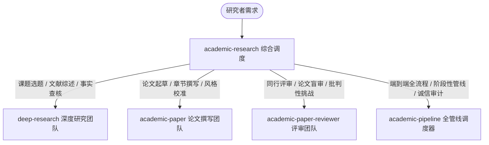

---
name: academic-research
description: "Academic Research Skills (ARS v3.21.2) — 学术研究人机协同全流程套件。涵盖从灵感研讨、文献检索（PRISMA/系统性综述）、论文起草（LaTeX/DOCX、风格校准、去AI味）、学术诚信硬闸门审查、到多视角同行评审（5席位审稿人+魔鬼代言人）以及论文修订返修（R&R Traceability Matrix）。触发关键词: academic research, academic research skill, ARS, academic-research-skills, 学术研究, 学术论文, 论文全流程, 深度调研, 论文评审, 论文润色, 审稿意见回复."
metadata:
  version: "3.21.2"
  upstream: "https://github.com/Imbad0202/academic-research-skills"
  status: active
  dependencies:
    - academic-pipeline
    - deep-research
    - academic-paper
    - academic-paper-reviewer
---

# Academic Research Skills (ARS v3.21.2) — 学术研究全流程技能套件

一套基于人机协同哲学（Human-in-the-Loop）的高阶学术研究套件，覆盖从课题研讨、文献深挖、论文起草、学术诚信审计到多视角同行评审与返修的全流程。

> **核心哲学：** AI 是你的副驾驶，不是机长。工具处理繁琐的高时间成本工作：文献交叉检索、格式排版、引文真实性验证、逻辑与断言一致性检查；研究者保持对核心科学问题、实验设计、数据解读与学术观点的绝对主导。

---

## 模块组成与架构路由

套件由 4 个核心专门技能协同组成，并可通过本入口统一调度：

### 1. `deep-research` — 深度学术调研与文献团队 (13-Agent)
- **定位**：无学科偏见的严谨学术调研体系。
- **模式**：
  - `full research`：从选题研讨到系统性调研报告生成
  - `lit-review`：文献综述矩阵与趋势提炼
  - `systematic review`：严格遵循 PRISMA 2020 标准的系统性文献综述与 Meta-analysis
  - `3W literature scan`：WHY / HOW / WHAT 三维文献扫描
  - `socratic guided dialogue`：苏格拉底式对话引导，帮研究者厘清模糊的研究方向
  - `fact-check`：学术事实与引文真实性核查
- **特色**：集成 Semantic Scholar、Crossref、arXiv、OpenAlex 数据库交叉检索验证，从根源杜绝幻觉引用。

### 2. `academic-paper` — 学术论文撰写与打磨团队 (12-Agent)
- **定位**：跨学科高学术质量论文起草、排版与润色。
- **模式**：
  - `full`：从大纲到完整草稿起草
  - `plan / outline`：逻辑链与篇章架构规划
  - `revision / revision-coach`：基于审稿意见的针对性修订与逐项响应
  - `style-calibration`：风格校准（从研究者既往代表作中学习行文节奏、句式偏好与词汇习惯，避免千篇一律的机器味）
  - `writing quality check`：写作质检机制，精准剔除 AI 高频套话、破折号滥用与刻板排比
  - `format-convert`：LaTeX / DOCX（Pandoc）/ APA 7.0 PDF 排版
  - `disclosure`：透明生成符合 Nature / IEEE / ICMJE 规范的 AI 使用声明

### 3. `academic-paper-reviewer` — 多视角同行评审模拟团队 (5-Seat Panel)
- **定位**：高仿真国际顶级期刊/顶会同侪评审。
- **评审席位**：
  - **Journal-Fit Reviewer**：期刊范围与受众匹配度评审
  - **Reviewer 1-3**：依据论文所属学科领域动态生成的 3 位专业审稿人（覆盖方法学、领域理论与跨学科视角）
  - **Devil's Advocate**：魔鬼代言人席位，专门以最挑剔视角攻击核心论点、寻找反例与逻辑漏洞
- **输出**：结构化审稿意见（Accept / Minor / Major / Reject）、修订路线图（Revision Roadmap）与 R&R 追溯矩阵。

### 4. `academic-pipeline` — 10 阶段端到端总管线调度器
- **定位**：串联上述三大技能的全自动化流水线。
- **10 阶段流程**：
  1. `Stage 1: Exploration & Intake`（研究边界与材料护照登记）
  2. `Stage 2: Deep Research`（文献调研与证据链梳理）
  3. `Stage 2.5: Pre-Writing Integrity Check`（阶段性学术诚信硬闸门：引文源头验证）
  4. `Stage 3: Drafting & Assembly`（论文草稿生成与风格校准）
  5. `Stage 4: Quality & Formatting`（格式规范与去 AI 质检）
  6. `Stage 4.5: Claim Alignment Audit`（核心论断与文献支撑对齐硬闸门）
  7. `Stage 5: First-Round Peer Review`（首轮 5 席位同行评审）
  8. `Stage 6: Revision & Coach`（修订与返修答辩信生成）
  9. `Stage 7: Second-Round Verification Review`（复审聚焦验证）
  10. `Stage 8: Final Integrity & Packaging`（终审一致性审计与成果归档）

---

## 常用操作与启动指引

### 典型任务场景

| 研究者任务 | 推荐调用指令 / 提问方式 | 目标承接技能 |
|---|---|---|
| **梳理研究方向与选题** | `帮我规划关于 [主题] 的研究方向与核心 gap` | `deep-research` (socratic / 3W) |
| **开展 PRISMA 文献综述** | `针对 [领域] 开展系统性文献综述，输出 PRISMA 流程与文献矩阵` | `deep-research` (systematic review) |
| **起草论文某章节** | `根据以下大纲与实验结果，起草 Introduction / Method 章节` | `academic-paper` (full / draft) |
| **剔除论文中的 AI 味** | `对这段论文草稿做 Writing Quality Check，去除 AI 高频词和模板腔` | `academic-paper` (quality-check) |
| **提交前模拟同行评审** | `帮我模拟 5 位国际期刊审稿人对我这篇论文进行盲审与批判性挑战` | `academic-paper-reviewer` (full review) |
| **审稿意见回复信 (Rebuttal)** | `根据附带的审稿人意见，协助我制作逐点回复与修订补实验计划` | `academic-paper` (revision / rebuttal-audit) |
| **端到端全流程推进** | `启动 academic-pipeline，从题目研讨一路做到论文终稿` | `academic-pipeline` (full workflow) |

---

## 本地配置与外部工具支持 (Optional)

- **本地仓库存放路径**：`C:\Users\lidong\academic-research-skills`（可通过 `git pull` 随时同步 upstream 升级）
- **DOCX 导出**：支持系统已安装的 `pandoc`。
- **LaTeX / PDF 导出**：支持 `tectonic` / TeXLive 环境。
- **文献库接入**：支持导入 Zotero 导出的 JSON 或本地 PDF 目录作为 Material Passport 语料库。