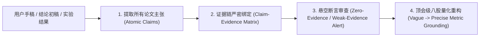

# Claim-Evidence Mapper Skill (顶会论文证据链映射与断言重构)

当用户需要梳理论文主张（Claims）、审查实验是否足以支撑结论、将泛泛的空话重构为顶会标准的量化严谨表达时，调用本 Skill。

---

## 核心机制 (Core Principles)

### 1. 绝对禁止无证据断言 (Zero Tolerance for Hallucinated Claims)
每个 Claim 必须归入以下四类硬核证据之一：
- **[Theorem / Proof]**：由数学定理、引理或显式推导严格证明。
- **[Empirical Benchmark]**：由基准实验的均值、方差（Std/Error Bar）和统计显著性（$p$-value）直接支撑。
- **[Ablation Evidence]**：通过严格控制变量的消融实验证明增益来源。
- **[Empirical Observation]**：在合成数据或特定可视化中复现的明确动力学/表征现象。

若某个 Claim 缺乏上述任何一项，必须标记为 **`[FLOATING CLAIM (悬空断言)]`** 并强制要求补实验或降级叙述。

### 2. 顶会文风量化重构规则 (Quantifiable Claim Transformation)
- ❌ **弱表达（容易被拒）**：*"Our method achieves significant improvements and is very robust against noises."*
- ✅ **顶会表达（高分采纳）**：*"Under 20% sensor corruption ratio, our spectral filter maintains an $R^2$ of 0.87 $\pm$ 0.02, outperforming the strongest baseline (Z-Net) by 14.3% ($p < 0.01$, paired t-test)."*

---

## 工作流与操作指南

### 步骤 1：构建 Claim-Evidence Matrix
将手稿中的主张拆解为原子命题，并填入以下标准矩阵（参考 `templates/claim_matrix_template.md`）：

| Claim ID | 论文主张 (Atomic Claim) | 证据类型 | 对应图表/公式/定理 | 支撑强度 (Strong/Weak/Zero) | 重构建议 / 补实验要求 |
| :--- | :--- | :--- | :--- | :--- | :--- |
| **C1** | 谱隙坍缩先于宏观状态转移发生 | Theorem & Exp | Theorem 3.1 & Figure 4 | **Strong** | 补充说明 $\Delta t$ 窗口在不同噪声下的鲁棒界 |
| **C2** | 本方法在大规模图上具有近线性复杂度 | Complexity Proof | Section 4.2 | **Weak** | 缺乏实际 Wall-clock time 随节点数 $N$ 的实测曲线 |
| **C3** | 我们的模型彻底解决了泛化崩溃问题 | N/A | None | **Zero (Fatal)** | 降级为 "alleviates generalization collapse on benchmarks A, B" |

### 步骤 2：调用 Prompt 执行量化重构
使用 `prompts/claim_refactor.md` 将定性结论转化为顶会标准的叙述段落。

---

## 交付产物规范

每次调用本 Skill，输出：
1. **📊 Claim-Evidence 证据链绑定表**
2. **⚠️ 悬空与高危断言预警清单 (Floating Claims to Fix)**
3. **✍️ 顶会量化重构文段 (LaTeX Ready Paragraphs)**
