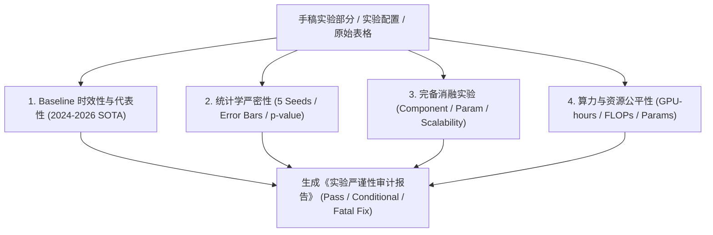

# Experiment Auditor Skill (顶会实验严谨性与基线审计师)

当用户完成实验代码或准备撰写 Experiments 章节时，调用本 Skill 对实验设计进行全方位严苛审查，拦截致命漏洞（如 Baseline 过旧、无随机种子误差棒、假消融）。

---

## 审查维度 (Audit Dimensions)

---

## 核心审查标准

### 1. Baseline 漏洞拦截 (Baseline Freshness & Variety)
- **致命缺陷 (Fatal Reject)**：仅对比 2020 年以前的古老经典算法（如仅比 vanilla GCN, LSTM, SVM）。
- **通过标准 (Pass)**：
  - 经典基础基线（2-3 个）。
  - 最近 1-2 年（2024-2026）顶会收录的 SOTA 基线（至少 3-4 个）。
  - 领域特定强基线（Domain-specific state-of-the-art）。

### 2. 统计学与方差审查 (Statistical Significance)
- **致命缺陷**：表格只有单一数字（无 $\pm \sigma$ 标准差），且没有注明随机种子数量。
- **通过标准**：
  - 至少 5 个不同随机种子（Random Seeds: e.g., 42, 123, 456, 789, 1024）。
  - 所有图表包含透明度或误差棒区间（95% Confidence Interval / Standard Deviation）。
  - 增益显著性标记（如配对 $t$ 检验或 Wilcoxon 检验 $p < 0.05$ 标记 $*$，$p < 0.01$ 标记 $**$）。

### 3. 消融实验完备性 (Ablation Completeness)
- 必须包含：
  - 模块剥离消融（w/o Component A, w/o Component B）。
  - 替换消融（Replace Component A with Standard MLP / Heuristic）。
  - 超参数敏感度曲面（Hyperparameter sensitivity curve across $\alpha, \beta, \gamma$）。

---

## 检查单与提示词
- 完整检查单：`checklists/empirical_rigor_checklist.md`
- 审计提示词：`prompts/auditor_prompt.md`
