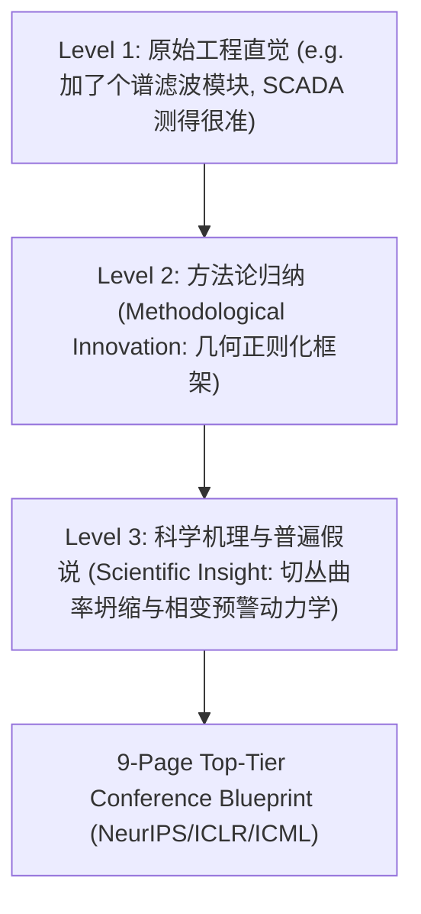

# Idea Framing & Storyline Architect Skill (顶会论文立意与故事架构师)

当用户拥有初步实验现象、代码原型或工程直觉，但需要将其包装升华成顶会级别的“Research Story”与完整架构时，调用本 Skill。

---

## 核心升华模型 (The Story Engineering Pyramid)

---

## 顶会三大贡献黄金公式 (The 3-Bullet Contribution Standard)

顶会手稿的 Introduction 结尾必须包含 3 个层次递进的 bullet points：

1. **Bullet 1: Foundational / Theoretical Insight (理论/机理洞察)**
   - 揭示了现有领域的什么普遍盲区，或从什么第一性原理（几何/动力学/谱论）出发建立了新的理论框架。
2. **Bullet 2: Algorithmic / Methodological Formulation (方法与算法创新)**
   - 提出了什么新颖、计算高效且有数学保证的算法（附带复杂度保证与闭式解/可微分目标）。
3. **Bullet 3: Comprehensive Empirical Validation (全面实证支撑)**
   - 在 X 个真实世界数据集与 Y 个合成基准上验证，提前预警时间提升 Z%，并提供了深刻的消融分析与案例可视化。

---

## 交付物与模板

- 完整 9 页论文蓝图模板：`templates/story_blueprint.md`
- 立意升华提示词：`prompts/idea_framing.md`
