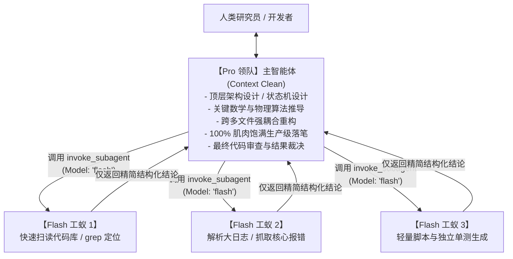

# Pro-Flash Orchestrator Skill (双模协同与防偷懒治理)

本 Skill 旨在解决小参数模型（如 Flash 系列）在复杂工程任务中因工作记忆容量有限、长文本注意力衰减和后训练惩罚导致的“缺胳膊少腿”（省略逻辑、留 `TODO`、跳过边界处理）问题。

通过建立 **“Pro 领队控全局与核心代码 + Flash 工蚁高并发跑腿检索”** 的双模分工体系，结合 **反偷懒硬约束 (Negative Prompting)** 与 **任务颗粒度降维协议 (Stepwise Delivery)**，实现既具备极高研发吞吐、又能保证 100% 生产级代码完整性的工程交付。

---

## 🏛️ 双模生态位分工体系 (Tiered Model Architecture)



### 1. 严格生态位划界 (Strict Ecological Boundary)

| 维度 | Pro 领队 (主模型) | Flash 工蚁 (子智能体) |
| :--- | :--- | :--- |
| **主要定位** | 控全局、深推理、重型生产代码编写 | 跑腿、信息搬运、高并发单点突破 |
| **核心职责** | • 从零搭建复杂工程系统与框架<br>• 数学/物理动力学理论公式逐行实现<br>• 跨文件复杂重构与依赖解耦<br>• 严格学术/顶会实验闭环与审计 | • 代码库跨目录关键字 grep 与定位<br>• 超长日志/文本关键异常摘要<br>• 查阅并归纳三方库文档/API<br>• 编写独立自包含的临时测试脚本 |
| **代码交付要求** | 必须 100% 饱满，包含全部类型注解与异常处理 | 单点聚焦，结果以简洁 Markdown/JSON 汇总 |
| **模型调度参数** | UI 界面直接锁定 `Pro` 档位 | `invoke_subagent` 显式设置 `Model: 'flash'` |

---

## 🚫 反偷懒刚性铁律 (Negative Prompting Guardrails)

在需要生成完整代码时，必须强制注入以下**反偷懒三不准原则**（详见 `templates/negative_prompting_rules.md`）：

> ### 🛑 【强制反偷懒约束】
> 1. **严禁使用任何占位符**：绝对禁止出现 `TODO`、`FIXME`、`pass`、`...`、`/* ... existing code ... */`、`# 其余逻辑类似` 等任何偷懒标记；
> 2. **必须给出可立即运行的端到端代码**：所有 `import` 引用、类初始化、工具函数、类型标注、错误捕获必须无一遗漏；
> 3. **严禁省略重复逻辑与边界分支**：所有分支条件（包括异常处理、空指针检查、极端边界）必须显式逐行写出，绝不允许以“同上”或“略”代替。

---

## 📐 任务颗粒度降维交付协议 (Stepwise Delivery Protocol)

为了彻底根治长文本生成时的自回归注意力衰减（Attention Drift），**严禁单次 Prompt 要求模型同时完成“系统设计 + 5个模块实现 + 测试验证”**。必须拆解为以下三步：


1. **Step 1: 接口与骨架冻结 (Interface Freeze)**
   * 先仅输出完整的类签名、函数签名、参数类型与类型注释；
   * 人类或主模型确认架构无误后，再推进下一步。
2. **Step 2: 逐模块原子填充 (Atomic Implementation)**
   * 每次对话只聚焦填充 **1 个具体模块/函数**；
   * 模型将所有注意力与上下文预算集中在当前这一个函数内部，彻底杜绝丢三落四。
3. **Step 3: 边界验证与联动测试 (Verification)**
   * 针对刚写完的模块，由 Flash 工蚁生成针对性单测，立即运行验证。

---

## ⚡ 子智能体调度标准化指令 (Flash Subagent Recipe)

主模型在需要进行大规模文件阅读、检索或繁琐排查时，不得污染主上下文，必须调用 `invoke_subagent` 并指定 `Model: 'flash'`：

```json
{
  "Subagents": [
    {
      "TypeName": "research",
      "Role": "Fast Codebase Investigator",
      "Model": "flash",
      "Workspace": "inherit",
      "Prompt": "【任务】使用 grep/view 工具扫描 src/ 目录下的所有指标实现。\n【约束】只提取与 Metric_A, Metric_B, Metric_Z 相关的函数签名和返回值行号，输出结构化 Markdown 表格，严禁带入无关代码。"
    }
  ]
}
```

---

## 📂 模板与配套资源

* `templates/negative_prompting_rules.md`: 可直接复制粘贴进 Prompt 的系统级反偷懒约束块。
* `templates/stepwise_delivery_workflow.md`: 复杂任务颗粒度降维的实战操作示范。
* `templates/subagent_dispatch_recipe.json`: 标准的 Flash 子智能体派发参数模板。

