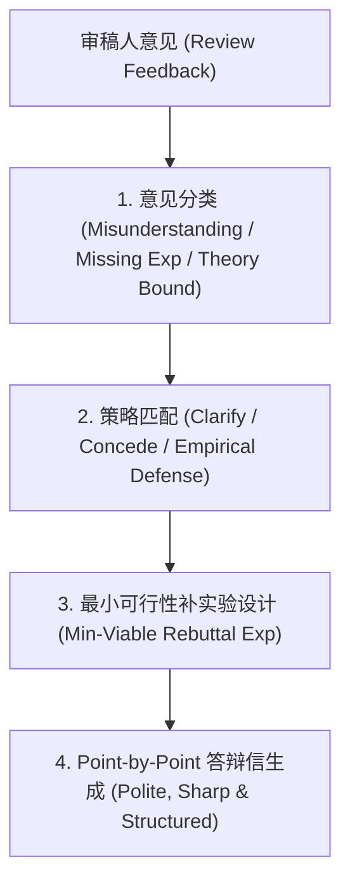

# Rebuttal Agent Skill (顶会论文 Rebuttal 辩护策略与答辩专家)

当用户收到正式审稿意见（或 `topconf-reviewer` 模拟的审稿报告）时，调用本 Skill 快速拆解弱点，制定最小化补实验策略，并生成格式标准的 Point-by-Point 答辩信。

---

## Rebuttal 黄金防守法则 (Rebuttal Principles)

### 1. 意见分类与应对策略 (Triage Matrix)
- **类别 A：审稿人存在理解偏差 (Reviewer Misunderstanding)**
  - *策略*：先礼貌感谢，再清晰指出原文的具体章节和公式（*"We appreciate the reviewer raising this point. We would like to gently clarify that in Section 3.2 (Eq. 4), our method already..."*）。
- **类别 B：要求补充 Baseline / 新数据集 (Missing Baseline/Dataset)**
  - *策略*：在 Rebuttal 阶段立即跑出精简版实验，用具体的量化数字（表格）直接在回复中打消疑虑。
- **类别 C：质疑理论假设过强 (Overly Restrictive Assumptions)**
  - *策略*：证明该假设在实际应用场景下广泛成立，或给出松弛假设后的数值实验表现。
- **类别 D：论文表述不清晰 (Writing / Typos / Clarity)**
  - *策略*：全盘欣然接受，并承诺在 Revision 中明确更新（附带修改后的具体段落）。

---

## 模板与核心提示词
- Rebuttal 答辩信标准模板：`templates/rebuttal_letter_template.md`
- 辩护策略生成器：`prompts/rebuttal_strategist.md`

---

## 输出规范
1. **📋 审稿人弱点拆解与优先级矩阵 (Weakness Triage Matrix)**
2. **🧪 72小时应急补实验清单 (72h Emergency Experiments)**
3. **✉️ 结构化 Rebuttal 答辩信 (Point-by-Point Rebuttal Draft)**
