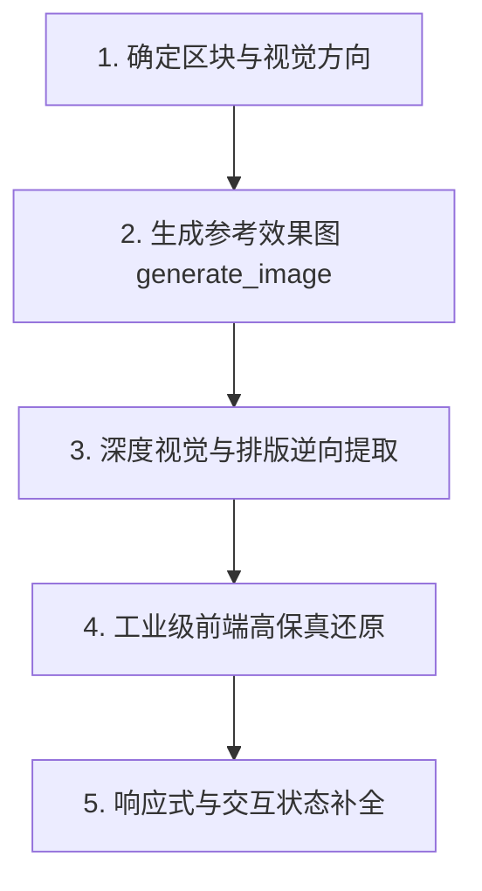

# 图像先行与视觉提取工作流 (Image-to-Code Protocol)

对于注重极致视觉质感的现代 Landing Page、官网或先锋创意界面，**在环境具备图像生成能力时，优先采用“图像先行、深度提取、高保真编码”的标准流程**。

---

## 1. 标准工作流 (The Image-First Pipeline)

1. **图先行 (Generate First)**：
   - 使用 `generate_image` 或外部设计稿生成具体的 Section 特写（而非一张高度压缩模糊的全站长图）。
   - 保证文字、间距、按钮与卡片在图面中清晰可辨。
2. **深提取 (Deep Extraction)**：
   - 将效果图视作真实的设计规范书 (Design Spec)，不搞泛泛的“感觉分析”，进行精准的工程反推。
3. **准还原 (Fidelity Code)**：
   - 运用现代 CSS、Tailwind 与 Motion 将视觉意图如实还原为生产级前端代码。

---

## 2. 深度视觉逆向提取清单 (Extraction Checklist)

在写代码前，系统性提取效果图中的以下 7 项设计参数：

1. **真实文案与标题 (Text & Copy)**：
   - 提取 Hero 主标题措辞、副标题、主 CTA 按钮文本与区块小标题。
   - 观察主标题的行数（控制在 1-2 行）与折行节奏。
2. **排版阶梯与性格 (Typography System)**：
   - 标题字体性格（几何大写无衬线 vs 优雅高反差衬线）。
   - 标题与正文字号的对比跨度（是否使用了极端的 Scale Contrast）。
3. **宏观间距与负空间 (Spacing Rhythm)**：
   - 标题到副标题、副标题到按钮的垂直间距。
   - 卡片内边距 (Padding) 与网格间隙 (Gap)。
   - 避免把宽敞透气的画廊式留白压缩成拥挤的代码。
4. **色彩与材质 (Colors & Materials)**：
   - 提取准确的背景底色（纯白 / 暖纸色 / 极黑 / 深海蓝）。
   - 提取主强调色 Hex 与高光反射线。
   - 提取卡片的表面处理（磨砂毛玻璃 / 实体纯色 / 1px 细线描边）。
5. **控件与圆角几何 (Component Geometry)**：
   - 按钮形态：全圆胶囊 (`rounded-full`) 还是硬朗小圆角 (`rounded-md`)？
   - 卡片倒角：大倒角 (`rounded-3xl`) 还是机械直角 (`rounded-none`)？
6. **视觉焦点与图像框架 (Media Framing)**：
   - 图像如何融入版面：全宽背景遮罩、固定比例框 (`aspect-[4/3]` 或 `aspect-video`)、还是与文字穿插交错？
7. **交互与动效潜台词 (Implied Motion)**：
   - 画面暗示了何种动效：自下而上淡入、视差滚动、卡片轻微悬浮还是磁吸下压？

---

## 3. 防套娃与小屏笔记本适配纪律

1. **严禁“盒中盒”嵌套地狱 (Anti-Nested-Box)**：
   - 杜绝：外层大卡片包裹中层卡片，中层卡片再塞满小圆角框的层层嵌套。
   - 提倡：开阔通透的版式，用直接的间距排版、单条细分割线或底色微差来区分区域，而非用容器把页面锁在盒子里。
2. **小屏笔记本视口适配 (Small Laptop Safe)**：
   - 保证在 13-14 寸笔记本（常见分辨率 1440×900 或 1366×768）首屏无需滚动即可完整看到：**品牌导航 + 主标题 + 精炼副标 + 主行动 CTA 按钮 + 核心视觉焦点的一部分**。
   - 严禁让巨大的顶部内边距 (`pt-48`) 将 CTA 挤出首屏。
