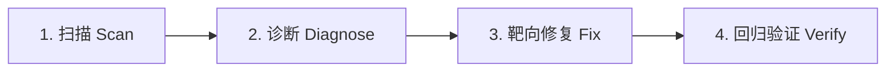

# 既有项目重构与审计协议 (Redesign Audit Protocol)

当针对现有 Web 项目或应用进行 UI/UX 重构与品质升级时，遵循本协议。**核心目标：在不破坏已有业务逻辑、不盲目重写架构的前提下，精准识别低质与 AI 模板特征，实施高收益、高审美的局部或系统级改良。**

---

## 1. 重构三步走工作流 (Scan → Diagnose → Fix)



1. **扫描 (Scan)**：
   - 识别当前技术栈（React / Next.js / Vue / HTML）、样式方案（Tailwind v3/v4, CSS Modules, Styled Components）与组件库依赖。
   - 尊重既有架构，不要未经允许将整个 CSS 方案从 Vanilla 强行重构成 Tailwind 或反之。
2. **诊断 (Diagnose)**：
   - 对照下方的【排查对照清单】，逐条列出所有 generic / slop 特征、缺失状态与断裂排版。
3. **靶向修复 (Fix)**：
   - 按照【升级优先级阶梯】实施精准手术式修改，每一次修改保持可审查、可还原。

---

## 2. 核心审计排查矩阵 (Audit Checklist)

### 2.1 排版与文字层次 (Typography)
- [ ] **默认字体泛滥**：全站是否充斥着未经定制的浏览器默认字体或廉价感字体？
  - *修复*：替换为有性格的高质感字体（如 `Geist`, `Outfit`, `Cabinet Grotesk`, `Satoshi`；严肃/出版类搭配优雅 Serif）。
- [ ] **大标题缺乏张力**：Display 标题是否字号偏小、字距松散？
  - *修复*：加大标题字号，紧缩字距 (`tracking-tight` / `-0.03em`)，收敛行高 (`leading-[1.1]`)。
- [ ] **正文行宽过长**：段落是否横跨全屏？
  - *修复*：限制正文最大宽度 `max-w-[65ch]`，增加字行距 `leading-relaxed`。
- [ ] **文本孤字换行 (Orphan Words)**：段落末尾是否单独掉落一个孤零零的单字？
  - *修复*：为标题和正文添加 `text-wrap: balance` 或 `text-wrap: pretty`。

### 2.2 色彩与质感 (Surfaces & Colors)
- [ ] **生硬的纯黑底色**：页面是否直接使用 `#000000` 作为大面积背景？
  - *修复*：换为微带中性色相的深炭黑（如 `#09090B`, `#0A0A0A`, `#121212`）。
- [ ] **强调色过多或过饱和**：页面是否存在超过 1 个冲突的亮色，或者饱和度高于 80%？
  - *修复*：提炼唯一的品牌主强调色，其余一律退回中性灰阶。
- [ ] **紫色/蓝色 AI 霓虹发光**：按钮和背景是否带着典型的 AI 廉价发光？
  - *修复*：移除无意义的发光层，改用清晰的 1px 边框 (`border-zinc-800`) 或高反差实体色块。
- [ ] **冷暖灰混杂**：同一页面内是否同时出现 `slate` (冷蓝灰) 和 `stone` (暖黄灰)？
  - *修复*：全局锁定单一灰度族系（统一为 `zinc` 或 `neutral`）。

### 2.3 布局与间距 (Layout & Spacing)
- [ ] **全屏绝对居中死板**：Hero 和所有 Section 是否全部机械居中？
  - *修复*：引入 50/50 左右分栏、非对称留白或图文左对齐。
- [ ] **固定 3 等宽卡片**：特性介绍是否是千篇一律的 3 个并排白底框？
  - *修复*：重构为 2 列交错、非对称 Bento 网格或纵向图文展示。
- [ ] **视口高度错误**：全屏区域是否使用了 `h-screen`？
  - *修复*：立即替换为 `min-h-[100dvh]` 消除移动端地址栏跳动。
- [ ] **呼吸空间不足**：区块之间是否拥挤？
  - *修复*：增大垂直间距（默认使用 `py-20` 至 `py-32`），让信息自然呼吸。
- [ ] **卡片底部 CTA 对不齐**：多列卡片内容高度不一时，底部按钮是否高低不齐？
  - *修复*：在卡片内部使用 `flex flex-col justify-between` 或 `mt-auto`，确保所有 CTA 在同一水平基线上对齐。

### 2.4 交互反馈与完整状态 (Interactivity & States)
- [ ] **按钮缺乏触觉反馈**：点击时是否没有任何物理微变化？
  - *修复*：添加 `:active:scale-[0.98]` 与平滑过渡 (`transition-all duration-200`)。
- [ ] **缺失 Focus Ring**：键盘 Tab 导航时焦点不可见？
  - *修复*：添加 `focus-visible:ring-2 focus-visible:ring-offset-2`，确保符合 a11y 标准。
- [ ] **状态缺失**：是否只有成功态，缺少 Loading 骨架屏、Empty 空状态与 Error 提示？
  - *修复*：完整补齐结构匹配的骨架屏与友好的错误文案。

---

## 3. 升级实施优先级阶梯 (Fix Priority)

按照以下顺序实施修复，以最小的风险获得最大的视觉与体验飞跃：

```text
1. 字体升级 (Font Swap)           ──> 最立竿见影、零业务风险
2. 色彩净化 (Color Palette)        ──> 清除杂色与 AI 紫光，锁定单一强调色
3. 交互手感 (Hover & Active)      ──> 赋予按钮和链接真实的物理触觉反馈
4. 间距与留白 (Layout & Spacing)   ──> 修正 max-w 约束与 min-h-[100dvh]，扩大 Section 留白
5. 替换模板化组件 (Component Mod)  ──> 将 3 列卡片重构为 Bento 或非对称结构
6. 补全完整状态 (States & A11y)    ──> 补齐 Skeleton 骨架屏、Empty 引导与键盘焦点
7. 细节打磨 (Typography & Motion) ──> 调整 tabular-nums、斜体保护与平滑滚动
```
