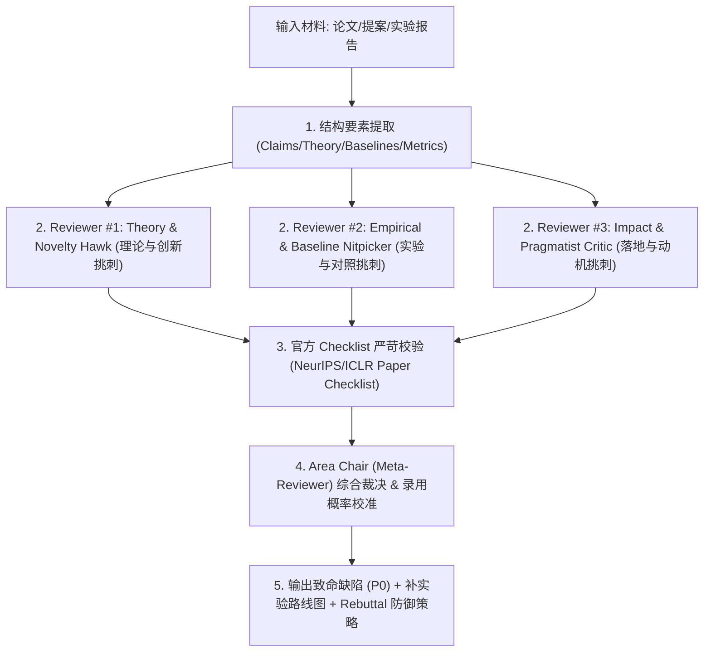

# Top-Tier Conference Reviewer Simulation Skill (顶会论文审稿人仿真自查)

当用户需要评估其论文手稿（Paper Draft）、研究构想（Research Idea / Proposal）、实验设计或阶段性报告时，调用本 Skill 执行严谨的顶会级多智能体同行评审（Peer Review Simulation）。

---

## 审稿流程规范 (Workflow)



---

## 审稿人角色定义与审查维度

### 1. Reviewer #1: Theory & Novelty Hawk (理论创新审稿人)
- **审查重点**：
  - 核心创新是否为“换皮（A+B 无机制洞察）”或“平凡推广（Trivial extension）”？
  - 定理与数学推导是否建立在不切实际的假设上（如线性可分、高斯白噪、玩具拓扑）？
  - 观察到的现象（如相变/泛化突变）是否有深层机理解释，还是停留于经验描述？
- **打分范围**：Soundness (1-4), Novelty (1-4), Overall (1-10), Confidence (1-5).

### 2. Reviewer #2: Empirical & Baseline Nitpicker (实验与基线审稿人)
- **审查重点**：
  - Baseline 是否偏旧？是否遗漏了近 1-2 年（2024-2025）的 SOTA 方法？
  - 是否存在消融缺失？增益究竟来自核心机制还是额外的参数量/超参微调？
  - 统计学显著性：是否有至少 5 个随机种子？是否有误差棒（Error bars/Std）和显著性检验（$p$-value）？
  - 算力开销与可扩展性（GPU Hours, Memory, Scaling to large-scale benchmark）。
- **打分范围**：Soundness (1-4), Empirical Rigor (1-4), Overall (1-10), Confidence (1-5).

### 3. Reviewer #3: Impact & Pragmatist Critic (现实价值与落地审稿人)
- **审查重点**：
  - 论文 Motivation 是否成立？解决的是真实工业/学术痛点还是人造玩具基准的伪需求？
  - 真实世界的分布偏移（Distribution Shift）与噪声环境下，方法是否会发生灾难性失效（Catastrophic failure）？
  - 是否清晰坦承了局限性（Limitations）与边界条件？
- **打分范围**：Soundness (1-4), Significance (1-4), Overall (1-10), Confidence (1-5).

### 4. Area Chair / Meta-Reviewer (综合裁决与录用概率预估)
- **输出内容**：
  - **Meta-Review Summary**：综合 3 位审稿人的共识与分歧，形成定性评价。
  - **顶会录用概率校准 (Calibrated Acceptance Likelihood)**：
    - NeurIPS 录用率预测（Top 25% 门槛，~10% Spotlight/Oral）
    - ICLR 录用率预测（Top 30% 门槛）
    - ICML 录用率预测（Top 27% 门槛）
    - AAAI / KDD 录用率预测（根据应用与数据特性分流）
  - **P0 致命缺陷清单（Must-fix before submission）**
  - **最小化补实验清单（Min-Viable Experiments to Flip Rejection）**
  - **预备 Rebuttal 辩护策略**

---

## 评审输出模板

每次调用此 Skill 时，严格遵循以下结构化 Markdown 格式输出：

```markdown
# 🏛️ Top-Tier Conference Review Simulation Report

## 📊 Executive Summary & Acceptance Calibration
| 会议 (Conference) | 预测录用概率 (Acceptance Probability) | 风险等级 (Risk Level) | 推荐投递梯队 |
| :--- | :--- | :--- | :--- |
| **NeurIPS** | XX% | High / Medium / Low | Main / Workshop / Pivot |
| **ICLR** | XX% | High / Medium / Low | Main / Reject |
| **ICML** | XX% | High / Medium / Low | Main / Reject |
| **AAAI / KDD** | XX% | High / Medium / Low | Strong Candidate |

---

## 👤 Reviewer #1 (Theory & Novelty Hawk)
- **Summary**: ...
- **Strengths**: ...
- **Weaknesses**:
  1. *[Novelty Attack]*: ...
  2. *[Theoretical Rigor]*: ...
- **Score**: Soundness: X/4 | Novelty: X/4 | Overall: X/10 | Confidence: X/5

---

## 👤 Reviewer #2 (Empirical & Baseline Nitpicker)
- **Strengths**: ...
- **Weaknesses**:
  1. *[Missing Baselines]*: ...
  2. *[Missing Ablations]*: ...
  3. *[Statistical Rigor]*: ...
- **Score**: Soundness: X/4 | Rigor: X/4 | Overall: X/10 | Confidence: X/5

---

## 👤 Reviewer #3 (Impact & Pragmatist Critic)
- **Strengths**: ...
- **Weaknesses**:
  1. *[Motivation & Problem Formulation]*: ...
  2. *[Distribution Shift & Limitations]*: ...
- **Score**: Soundness: X/4 | Significance: X/4 | Overall: X/10 | Confidence: X/5

---

## 📋 Official Paper Checklist Audit (NeurIPS / ICLR)
- [ ] **Q1 (Claims & Evidence)**: 是否每个 Claim 都有充分证据支持？
- [ ] **Q2 (Limitations)**: 是否在正文中设有专门的 Limitations 章节？
- [ ] **Q3 (Theory Assumptions)**: 是否明确列出所有数学假设与证明附录？
- [ ] **Q4 (Error Bars & Seeds)**: 是否报告了随机种子与方差？
- [ ] **Q5 (Compute & Reproducibility)**: 是否披露了算力、超参数搜索空间与开源代码链接？

---

## 🚨 P0 致命缺陷拦截清单 (Must Fix Before Submission)
1. **[P0]** ...
2. **[P0]** ...

## 🧪 最小化补实验清单 (Min-Viable Experiments to Flip Rejection)
1. ...

## 🛡️ 预备 Rebuttal 防御策略
- **针对 Reviewer 1 的理论质疑**: ...
- **针对 Reviewer 2 的实验攻击**: ...
- **针对 Reviewer 3 的落地担忧**: ...
```
