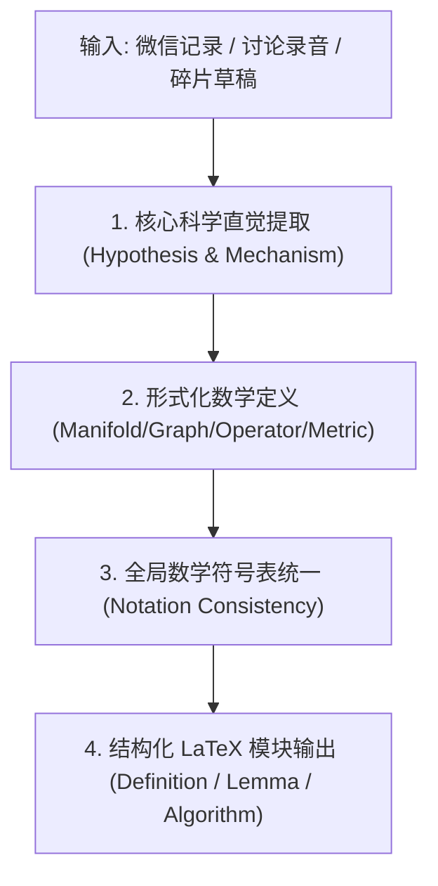

# Vibe-to-LaTeX Skill (科研直觉与笔记转顶会数学化手稿)

当用户输入非正式的中文讨论、碎片化的科研直觉、实验随笔或导师沟通记录时，调用本 Skill 快速将 “Vibe / Intuition” 升级为标准的顶会级 LaTeX 表达。

---

## 核心转化管线 (Pipeline)

---

## 转化规范与规则

### 1. 概念升华规范 (Abstraction Ladder)
- **口语表述**：“当系统快要崩的时候，几个特征值会挤在一起，算出来的曲率也会跳水。”
- **数学定义**：
  $$\text{Let } \mathcal{M} \text{ be a Riemannian manifold with Ricci curvature } \mathrm{Ric}(v, v). \text{ Near the bifurcation point } t^*, \text{ the spectral gap } \gamma(t) = \lambda_2(t) - \lambda_1(t) \to 0, \text{ inducing a curvature singularity } \lim_{t \to t^*} \kappa_R(t) = -\infty.$$
- **论文八股文**：
  *"We formalize this intuition by modeling the system trajectory on a Riemannian manifold, establishing that spectral gap collapse is topologically dual to a curvature singularity preceding critical transitions."*

### 2. 符号一致性矩阵 (Notation Standard)
- 标量：$s, c, t, \alpha, \lambda$
- 向量：$\mathbf{x}, \mathbf{y}, \mathbf{v} \in \mathbb{R}^d$（粗体小写）
- 矩阵/算子：$\mathbf{A}, \mathbf{W}, \mathbf{L} \in \mathbb{R}^{n \times n}$（粗体大写）
- 流形/集合/图：$\mathcal{M}, \mathcal{G} = (\mathcal{V}, \mathcal{E}), \mathcal{S}$（花体大写）
- 期望与概率：$\mathbb{E}[\cdot], \mathbb{P}(\cdot)$（黑板粗体）

---

## 常用工具与模板库
- 模板库：`templates/latex_math_templates.md`（涵盖 Problem Formulation, Definition, Theorem, Algorithm 伪代码）
- 核心提示词：`prompts/vibe_formalizer.md`

---

## 输出内容格式
1. **🔬 核心假设与形式化陈述 (Formal Hypothesis)**
2. **📐 全文数学符号对照表 (Notation Table)**
3. **📄 可直接编译的 LaTeX 代码块 (LaTeX Environment Ready: `definition`, `theorem`, `proof`)**
