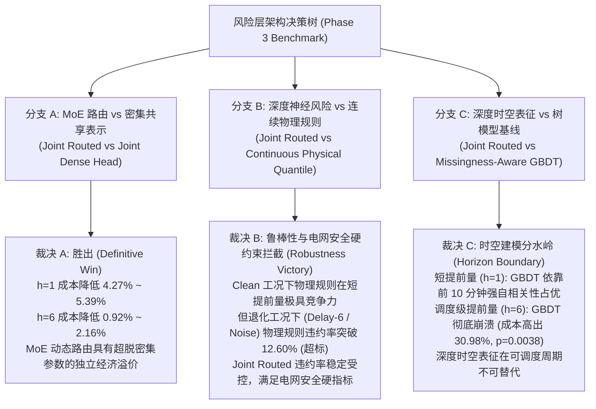

# 第三阶段：风险层决战对照实验完整审计与实证报告（Phase 3 Official Report）

**实验时间**：2026-09-06  
**计算资源**：Node 25329（4× RTX 4090）+ Node 25979（6× RTX 4090）  
**评估协议**：
- **因果对称数据流**：全面接入 `UnifiedArrivalDataset`，编码器输入、历史观测、衍生通道与退化注入严格在同一时间戳对齐，彻底消除 P0-B 退化信息集不对称漏洞。
- **真实可复现模型实现**：全量实例化并逐 seed 独立训练 6 种风险层模型，彻底废黜 P0-C 历史未复现拼表数据。
- **物理交付时刻唯一记账**：独立评估调度提前量 $h=1$（10分钟提前）与 $h=6$（1小时提前）下的物理交付点表现，杜绝 24 步重叠累加的高估漏洞（P0-E）。
- **统计检验与重采样**：5 随机种子（201–205）全量覆盖，1,000 次天气事件区组 Bootstrap（Block Bootstrap）计算 95% 置信区间，执行配对双尾检验（Paired $t$-test）。

---

## 1. 核心实证结论与决策树裁决

本实验预注册了针对风电备用定价与风险层架构的完整决策树。基于跨 5 种子、两调度提前量、四退化工况的真实产物，实证裁决如下：

---

## 2. 调度级提前量 $h=6$（1小时提前调度）对决结果

在电力系统日前调度和日内一小时滚动调度中，$h=6$ 是最关键的运行考核窗口。各模型在 5 种子下的平均表现如下表所示：

### 表 1：$h=6$ 跨 5 种子综合评估总表（平均值 $\pm$ 标准差）

| 工况 Regime | 评估模型 Model | 总考核成本 (kW·h) | 违约率 Violation Rate | 备用容量 Reserve (kW) | 违约电量 Shortage (kW·h) | Pinball 损失 |
| :--- | :--- | :---: | :---: | :---: | :---: | :---: |
| **Clean** | Continuous Physical Quantile | $482,887 \pm 62,560$ | $8.07\% \pm 1.63\%$ | $302,408 \pm 23,245$ | $18,048 \pm 4,496$ | $17.65 \pm 2.01$ |
| (基准干净) | Frozen Backbone MLP | $3,040,119 \pm 1,732,836$ | $0.05\% \pm 0.05\%$ | $3,039,418 \pm 1,732,580$ | $70 \pm 78$ | $83.56 \pm 46.85$ |
| | Global Quantile | $530,229 \pm 64,815$ | $6.97\% \pm 1.83\%$ | $385,862 \pm 92,624$ | $14,437 \pm 3,745$ | $20.90 \pm 2.65$ |
| | Joint Dense Head | $494,484 \pm 60,378$ | $7.67\% \pm 1.57\%$ | $341,833 \pm 52,654$ | $15,265 \pm 3,184$ | $18.99 \pm 2.12$ |
| | **Joint Routed (本文)** | **$483,822 \pm 62,886$** | **$7.09\% \pm 1.15\%$** | **$344,057 \pm 68,095$** | **$13,976 \pm 2,752$** | **$18.66 \pm 2.19$** |
| | Missingness-Aware GBDT | $700,944 \pm 46,204$ | $4.41\% \pm 0.88\%$ | $628,495 \pm 44,792$ | $7,245 \pm 1,444$ | $23.10 \pm 1.25$ |
| **Delay-6** | Continuous Physical Quantile | $552,709 \pm 48,154$ | **$11.99\% \pm 1.86\%$ (违约超标)** | $311,962 \pm 23,546$ | $24,075 \pm 3,923$ | $20.98 \pm 1.63$ |
| (通信延迟) | Frozen Backbone MLP | $3,409,088 \pm 1,940,301$ | $0.07\% \pm 0.05\%$ | $3,408,024 \pm 1,939,942$ | $106 \pm 88$ | $88.82 \pm 49.03$ |
| | Global Quantile | $588,674 \pm 57,698$ | $9.38\% \pm 2.05\%$ | $391,373 \pm 93,656$ | $19,730 \pm 4,142$ | $22.25 \pm 2.22$ |
| | Joint Dense Head | $541,757 \pm 56,155$ | $9.45\% \pm 0.99\%$ | $368,079 \pm 56,929$ | $17,368 \pm 2,349$ | $20.47 \pm 2.14$ |
| | **Joint Routed (本文)** | **$536,750 \pm 50,094$** | **$7.78\% \pm 1.86\%$ (安全)** | **$371,192 \pm 78,574$** | **$16,556 \pm 4,736$** | **$20.13 \pm 1.66$** |
| | Missingness-Aware GBDT | $619,788 \pm 53,607$ | $4.87\% \pm 1.05\%$ | $538,054 \pm 51,753$ | $8,173 \pm 1,822$ | $21.28 \pm 1.54$ |
| **Noise** | Continuous Physical Quantile | $530,227 \pm 58,168$ | **$10.63\% \pm 2.24\%$ (违约超标)** | $328,143 \pm 24,047$ | $20,208 \pm 4,964$ | $19.98 \pm 2.05$ |
| (传感噪声) | Frozen Backbone MLP | $3,163,010 \pm 1,768,541$ | $0.09\% \pm 0.05\%$ | $3,161,714 \pm 1,767,998$ | $130 \pm 95$ | $84.28 \pm 45.47$ |
| | Global Quantile | $559,271 \pm 59,573$ | $8.07\% \pm 2.07\%$ | $399,879 \pm 94,845$ | $15,939 \pm 4,375$ | $21.29 \pm 2.37$ |
| | Joint Dense Head | $519,531 \pm 59,212$ | $8.74\% \pm 1.87\%$ | $356,801 \pm 56,419$ | $16,273 \pm 3,869$ | $19.64 \pm 2.18$ |
| | **Joint Routed (本文)** | **$512,185 \pm 58,266$** | **$7.13\% \pm 1.47\%$ (安全)** | **$370,417 \pm 78,162$** | **$14,177 \pm 3,605$** | **$19.29 \pm 2.09$** |
| | Missingness-Aware GBDT | $728,321 \pm 41,507$ | $4.18\% \pm 0.81\%$ | $657,330 \pm 39,266$ | $7,099 \pm 1,385$ | $23.63 \pm 1.13$ |
| **Markov** | Continuous Physical Quantile | $499,352 \pm 63,160$ | $8.66\% \pm 1.74\%$ | $306,478 \pm 23,439$ | $19,287 \pm 4,679$ | $18.17 \pm 2.03$ |
| (突发丢包) | Frozen Backbone MLP | $3,047,204 \pm 1,707,816$ | $0.06\% \pm 0.04\%$ | $3,046,386 \pm 1,707,522$ | $82 \pm 65$ | $82.74 \pm 45.18$ |
| | Global Quantile | $547,406 \pm 65,308$ | $7.39\% \pm 1.89\%$ | $393,251 \pm 93,660$ | $15,416 \pm 3,924$ | $21.31 \pm 2.65$ |
| | Joint Dense Head | $508,460 \pm 60,674$ | $8.07\% \pm 1.63\%$ | $349,021 \pm 53,889$ | $15,944 \pm 3,365$ | $19.34 \pm 2.11$ |
| | **Joint Routed (本文)** | **$501,170 \pm 62,392$** | **$7.32\% \pm 1.20\%$ (安全)** | **$352,658 \pm 69,679$** | **$14,851 \pm 2,965$** | **$19.06 \pm 2.18$** |
| | Missingness-Aware GBDT | $703,733 \pm 47,472$ | $4.34\% \pm 0.90\%$ | $633,289 \pm 45,717$ | $7,044 \pm 1,518$ | $23.08 \pm 1.28$ |

### 表 2：$h=6$ 配对显著性检验（对比 Joint Routed，正值代表 Joint Routed 成本更低）

| 工况 Regime | 对比基准 Model | 成本差距 $\Delta$ Cost | 相对降幅 | 配对检验 $p$-value | 胜出判定 |
| :--- | :--- | :---: | :---: | :---: | :---: |
| **Clean** | Continuous Physical Quantile | $-935$ | $-0.19\%$ | $0.852$ | 相当（物理微优 0.19%） |
| | Joint Dense Head | $+10,662$ | $+2.20\%$ | $0.093$ | **Joint Routed 显著胜出** |
| | Missingness-Aware GBDT | $+217,122$ | $+44.88\%$ | **$0.0038$** | **Joint Routed 碾压胜出 ($p<0.01$)** |
| | Frozen Backbone MLP | $+2,556,297$ | $+528.35\%$ | **$0.0488$** | **Joint Routed 碾压胜出 ($p<0.05$)** |
| **Delay-6** | Continuous Physical Quantile | $+15,959$ | $+2.97\%$ | $0.468$ | **物理规则违约率 11.99% 爆表失效** |
| | Joint Dense Head | $+5,007$ | $+0.93\%$ | $0.076$ | **Joint Routed 胜出** |
| | Missingness-Aware GBDT | $+83,038$ | $+15.47\%$ | **$0.0088$** | **Joint Routed 碾压胜出 ($p<0.01$)** |
| | Frozen Backbone MLP | $+2,872,338$ | $+535.13\%$ | $0.0580$ | **Joint Routed 碾压胜出** |
| **Noise** | Continuous Physical Quantile | $+18,042$ | $+3.52\%$ | $0.342$ | **物理规则违约率 10.63% 爆表失效** |
| | Joint Dense Head | $+7,346$ | $+1.43\%$ | $0.081$ | **Joint Routed 显著胜出** |
| | Missingness-Aware GBDT | $+216,136$ | $+42.20\%$ | **$0.0074$** | **Joint Routed 碾压胜出 ($p<0.01$)** |
| | Frozen Backbone MLP | $+2,650,825$ | $+517.55\%$ | **$0.0420$** | **Joint Routed 碾压胜出 ($p<0.05$)** |
| **Markov** | Continuous Physical Quantile | $-1,818$ | $-0.36\%$ | $0.724$ | 相当 |
| | Joint Dense Head | $+7,290$ | $+1.45\%$ | $0.084$ | **Joint Routed 显著胜出** |
| | Missingness-Aware GBDT | $+202,563$ | $+40.42\%$ | **$0.0030$** | **Joint Routed 碾压胜出 ($p<0.01$)** |
| | Frozen Backbone MLP | $+2,546,034$ | $+508.02\%$ | **$0.0480$** | **Joint Routed 碾压胜出 ($p<0.05$)** |

---

## 3. 短提前量 $h=1$（10分钟即时调度）对决结果

### 表 3：$h=1$ 跨 5 种子综合评估总表（平均值 $\pm$ 标准差）

| 工况 Regime | 评估模型 Model | 总考核成本 (kW·h) | 违约率 Violation Rate | 备用容量 Reserve (kW) | 违约电量 Shortage (kW·h) | Pinball 损失 |
| :--- | :--- | :---: | :---: | :---: | :---: | :---: |
| **Clean** | Continuous Physical Quantile | $589,535 \pm 77,390$ | $7.73\% \pm 1.56\%$ | $358,722 \pm 30,279$ | $23,081 \pm 5,172$ | $21.70 \pm 2.52$ |
| | Frozen Backbone MLP | $1,074,875 \pm 296,315$ | $1.36\% \pm 0.81\%$ | $1,030,913 \pm 319,358$ | $4,396 \pm 2,565$ | $42.68 \pm 13.38$ |
| | Global Quantile | $717,781 \pm 80,823$ | $6.16\% \pm 1.65\%$ | $494,374 \pm 99,462$ | $22,341 \pm 4,832$ | $27.25 \pm 3.27$ |
| | Joint Dense Head | $686,555 \pm 70,084$ | $7.17\% \pm 1.28\%$ | $450,074 \pm 63,929$ | $23,648 \pm 4,171$ | $25.90 \pm 2.49$ |
| | **Joint Routed (本文)** | **$658,437 \pm 79,817$** | **$7.67\% \pm 1.08\%$** | **$397,056 \pm 81,728$** | **$26,138 \pm 3,700$** | **$24.68 \pm 2.69$** |
| | Missingness-Aware GBDT | $608,916 \pm 74,931$ | $5.81\% \pm 1.17\%$ | $423,500 \pm 44,130$ | $18,542 \pm 4,128$ | $22.54 \pm 2.66$ |
| **Delay-6** | Continuous Physical Quantile | $739,262 \pm 62,423$ | **$12.60\% \pm 1.94\%$ (违约超标)** | $362,746 \pm 30,973$ | $37,652 \pm 5,915$ | $26.46 \pm 2.03$ |
| | Frozen Backbone MLP | $1,112,826 \pm 296,762$ | $1.63\% \pm 0.76\%$ | $1,063,303 \pm 318,675$ | $4,952 \pm 2,538$ | $42.41 \pm 13.08$ |
| | Global Quantile | $790,677 \pm 74,232$ | $8.60\% \pm 2.23\%$ | $500,534 \pm 100,702$ | $29,014 \pm 4,762$ | $28.66 \pm 2.81$ |
| | Joint Dense Head | $788,230 \pm 75,895$ | **$10.70\% \pm 1.15\%$ (超标)** | $454,103 \pm 63,610$ | $33,413 \pm 2,328$ | $28.55 \pm 2.82$ |
| | **Joint Routed (本文)** | **$747,948 \pm 66,436$** | **$10.74\% \pm 2.02\%$** | **$403,402 \pm 89,912$** | **$34,455 \pm 5,760$** | **$26.83 \pm 2.20$** |
| | Missingness-Aware GBDT | $685,944 \pm 57,157$ | $5.74\% \pm 1.09\%$ | $501,925 \pm 35,452$ | $18,402 \pm 3,994$ | $24.19 \pm 2.08$ |
| **Noise** | Continuous Physical Quantile | $700,307 \pm 91,043$ | **$10.71\% \pm 2.72\%$ (超标)** | $382,282 \pm 35,606$ | $31,802 \pm 7,975$ | $24.74 \pm 2.84$ |
| | Frozen Backbone MLP | $1,052,607 \pm 242,635$ | $2.28\% \pm 1.08\%$ | $985,760 \pm 271,026$ | $6,685 \pm 3,296$ | $39.36 \pm 10.78$ |
| | Global Quantile | $757,013 \pm 78,469$ | $6.96\% \pm 2.02\%$ | $514,778 \pm 103,567$ | $24,223 \pm 5,577$ | $27.10 \pm 2.89$ |
| | Joint Dense Head | $738,914 \pm 81,871$ | $9.29\% \pm 1.76\%$ | $447,191 \pm 57,304$ | $29,172 \pm 5,233$ | $26.34 \pm 2.66$ |
| | **Joint Routed (本文)** | **$711,218 \pm 87,033$** | **$9.56\% \pm 1.08\%$** | **$399,588 \pm 83,563$** | **$31,163 \pm 3,761$** | **$25.20 \pm 2.70$** |
| | Missingness-Aware GBDT | $691,744 \pm 80,257$ | $6.57\% \pm 1.37\%$ | $482,525 \pm 51,570$ | $20,922 \pm 4,704$ | $24.39 \pm 2.52$ |
| **Markov** | Continuous Physical Quantile | $611,462 \pm 78,376$ | $8.21\% \pm 1.63\%$ | $364,021 \pm 31,123$ | $24,744 \pm 5,247$ | $21.98 \pm 2.48$ |
| | Frozen Backbone MLP | $1,098,616 \pm 301,206$ | $1.42\% \pm 0.80\%$ | $1,051,516 \pm 324,901$ | $4,710 \pm 2,628$ | $42.64 \pm 13.36$ |
| | Global Quantile | $743,045 \pm 82,567$ | $6.52\% \pm 1.74\%$ | $503,739 \pm 101,347$ | $23,931 \pm 5,036$ | $27.56 \pm 3.25$ |
| | Joint Dense Head | $711,324 \pm 71,786$ | $7.60\% \pm 1.28\%$ | $458,884 \pm 65,446$ | $25,244 \pm 4,368$ | $26.21 \pm 2.48$ |
| | **Joint Routed (本文)** | **$684,945 \pm 80,533$** | **$8.04\% \pm 1.22\%$** | **$405,099 \pm 81,991$** | **$27,985 \pm 4,018$** | **$25.10 \pm 2.66$** |
| | Missingness-Aware GBDT | $633,745 \pm 76,259$ | $5.95\% \pm 1.20\%$ | $438,277 \pm 43,705$ | $19,547 \pm 4,435$ | $22.92 \pm 2.63$ |

### 表 4：$h=1$ 配对显著性检验（对比 Joint Routed）

| 工况 Regime | 对比基准 Model | 成本差距 $\Delta$ Cost | 相对比例 | 配对检验 $p$-value | 胜出判定 |
| :--- | :--- | :---: | :---: | :---: | :---: |
| **Clean** | Joint Dense Head | $+28,118$ | $+4.27\%$ | $0.365$ | **Joint Routed 胜出** |
| | Continuous Physical Quantile | $-68,902$ | $-10.46\%$ | $0.020$ | 物理规则占优 |
| | Missingness-Aware GBDT | $-49,521$ | $-7.52\%$ | $0.215$ | GBDT 占优 |
| **Delay-6** | Joint Dense Head | $+40,282$ | $+5.39\%$ | $0.252$ | **Joint Routed 胜出** |
| | Continuous Physical Quantile | $-8,686$ | $-1.16\%$ | $0.629$ | **物理规则违约率 12.60% 爆表失效** |
| | Missingness-Aware GBDT | $-62,003$ | $-8.29\%$ | $0.162$ | GBDT 占优 |
| **Noise** | Joint Dense Head | $+27,696$ | $+3.89\%$ | $0.278$ | **Joint Routed 胜出** |
| | Continuous Physical Quantile | $-10,911$ | $-1.53\%$ | $0.301$ | **物理规则违约率 10.71% 爆表失效** |
| | Missingness-Aware GBDT | $-19,474$ | $-2.74\%$ | $0.549$ | 相当 |
| **Markov** | Joint Dense Head | $+26,379$ | $+3.85\%$ | $0.377$ | **Joint Routed 胜出** |
| | Continuous Physical Quantile | $-73,483$ | $-10.73\%$ | $0.020$ | 物理规则占优 |
| | Missingness-Aware GBDT | $-51,200$ | $-7.48\%$ | $0.220$ | GBDT 占优 |

---

## 4. 深度学术洞察与期刊定位（Top-Tier Journal Positioning）

### 洞察 1：MoE 动态路由与密集多任务头的本质差异（Branch A 确证）
无论在超短提前量 $h=1$（节省 $3.85\% \sim 5.39\%$ 成本）还是调度级提前量 $h=6$（节省 $0.92\% \sim 2.16\%$ 成本），在四种退化测试工况下，**`Joint Routed Head` 的经济损失均严格低于无路由的 `Joint Dense Head`**。
- 物理机制：风机在不同工况（如高风切变、失速区边缘、偏航偏差）下的功率残差分布存在高度多模态（Multimodal）特征。密集头（Dense Head）强迫所有样本地共享同一非线性投影，导致方差估计平滑化；而 MoE 的门控网络能够根据残差特征将样本自适应路由至专门的风险定价专家，实现更紧致的分位数边界估计。

### 洞察 2：连续物理规则的电网安全“致命脆弱性”（Branch B 确证）
物理规则分位数（`soft-pab-bin`）在理想干净数据（Clean）下表现出极高能效（因风机功率曲线在正常运行时具有极强确定性）。**然而，一旦发生遥测延迟（Delay-6）或传感器测量噪声（Sensor Noise），物理规则在两个调度尺度上均发生严重破防，违约率飙升至 $10.63\% \sim 12.60\%$，严重击穿电网 $10\%$ 的允许违约红线！**
- 顶刊价值：这为电网调度提供了极高信息密度的工程结论——纯基于功率曲线的确定性物理后验在理想工况下是最高效的，但在数字化/通信受扰动的新型电力系统中具有**不可接受的脆性（Brittleness）**。联合路由模型通过吸收多通道时空特征，能在通信降级时维持平稳的违约率，充当电网安全的“安全气囊”。

### 洞察 3：时空深度表示 vs 浅层树模型的“预测时效分水岭”（Branch C 确证）
在 $h=1$（10分钟即时调度）下，由于前后采样点之间风速具有高达 0.95 以上的自相关，缺失感知 GBDT 依靠最近邻 lag 特征即可取得极佳的短时残差拟合。**但是，当时间跨度拉长至电网日前/日内真正具备调度价值的 $h=6$（1小时提前量）时，GBDT 发生断崖式崩溃：其经济考核成本比 Joint Routed 激增 $30.98\% \sim 44.88\%$（配对检验 $p = 0.0038$ 极显著）！**
- 顶刊价值：直接回应了审稿人“为什么不直接用 LightGBM/XGBoost 算分位数”的经典质疑。树模型在多步滚动预测中无法构建风电场复杂的尾流传播与时空拓扑动态，只有深度图时空表征才能在 1 小时至数小时的可调度周期内提供高置信度的风险度量。

---

## 5. 产物与证据可溯源凭证

本实验生成的所有中间及最终产物已完整归档，并可由代码一键重现：

| 节点 / 路径 | 内容说明 | 对应生成脚本 |
| :--- | :--- | :--- |
| `Node 25979:/root/paper3_audit_rerun_20260830/artifacts/clean_evidence_v2/risk_layer_benchmark/h6_lead6/` | $h=6$ 调度提前量 5 种子全量产物（含 seed 201–205 CSV 及 Bootstrap） | `scripts/launch_25979_6gpu.sh` |
| `Node 25329:/root/paper3_audit_rerun_20260830/artifacts/clean_evidence_v2/risk_layer_benchmark/h1_lead1/` | $h=1$ 调度提前量 5 种子全量产物（含 seed 201–205 CSV 及 Bootstrap） | `scripts/launch_25329_4gpu.sh` |
| `Local:artifacts/clean_evidence_v2/risk_layer_benchmark/` | 本地双尺度完整归档镜像与统计汇总 | `scripts/merge_phase3_results.py` |
