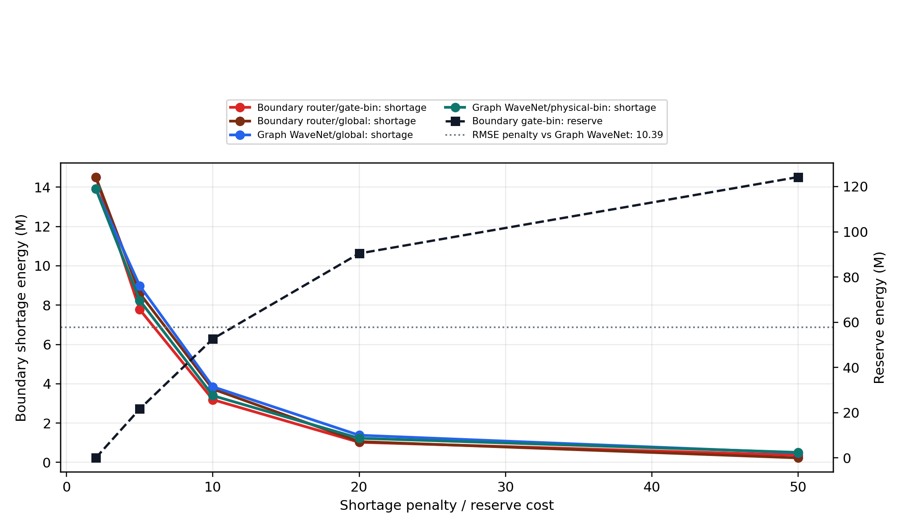
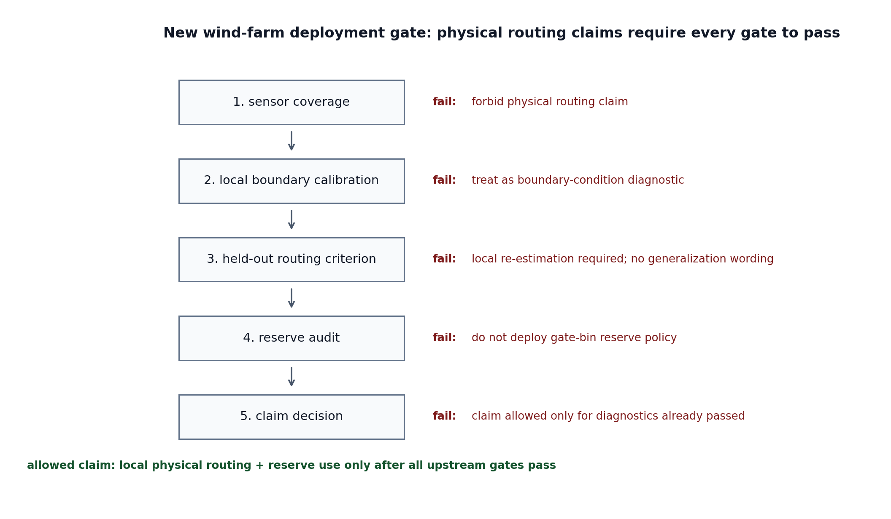

---
documentclass: article
classoption:
  - 11pt
geometry:
  - a4paper
  - margin=1in
mainfont: TeX Gyre Termes
mathfont: TeX Gyre Termes Math
bibliography: references.bib
csl: elsevier-numbered.csl
citeproc: true
link-citations: true
numbersections: true
secnumdepth: 3
date: ""
header-includes:
  - \usepackage[most]{tcolorbox}
  - \usepackage{enumitem}
  - \usepackage{tabularx}
  - \usepackage{booktabs}
  - \usepackage{caption}
  - \usepackage{float}
  - \usepackage{etoolbox}
  - \usepackage{xcolor}
  - \setlength{\parskip}{0.45em}
  - \setlength{\parindent}{1.2em}
  - \setlist[itemize]{leftmargin=1.6em}
  - \captionsetup[table]{font=small, labelfont=bf, labelsep=period, skip=4pt}
  - \definecolor{aegray}{HTML}{6E6E6E}
  - \definecolor{aelight}{HTML}{F3F4F6}
  - \definecolor{aeline}{HTML}{D7D9DC}
  - \definecolor{aecite}{HTML}{7A3EF0}
---

\begin{center}
\begin{minipage}{0.94\textwidth}
\centering
\Large\bfseries Physics-Informed Reserve Diagnostics for Wind-Power Transition Windows: An Auditable Regime-Aware Forecasting Framework\par
\vspace{0.6em}
\normalsize Junyu Li\textsuperscript{a}\qquad Juntao Du\textsuperscript{a,*}\par
\vspace{0.35em}
\small \textsuperscript{a} School of Statistics and Applied Mathematics, Anhui University of Finance and Economics, Bengbu, 233030, China\par
\end{minipage}
\end{center}

\vspace{0.05em}

\noindent{\scriptsize *Corresponding author.\par}
\noindent{\scriptsize Email addresses: \texttt{ljylikezmn999@gmail.com} (Junyu Li), \texttt{dujuntao@aufe.edu.cn} (Juntao Du)\par}

\vspace{0.35em}

\noindent{\small\bfseries Abstract\par}
\vspace{0.18em}
\small
Reserve planning for wind-integrated power systems is most fragile when forecast errors change an operating decision rather than only an aggregate error score. The wind-turbine transition from maximum power point tracking (MPPT) to blade-pitch control concentrates this exposure: over-forecasts near rated operation translate into unmet reserve requirements, while fleet-level RMSE can dilute the risk. We develop a SCADA-constrained, physics-informed reserve diagnostic that uses regime-aware routing to make the MPPT-to-pitch transition window auditable. On the KDD Cup 2022 wind-farm benchmark, the gate recovers the declared MPPT-to-pitch partition (NMI about 0.87). At shortage-to-reserve cost ratio 10, gate-conditioned binning reduces same-model boundary-window violation from 10.38% to 9.00%, cuts shortage energy by about 14.5%, and adds about 3.6% reserve energy relative to the same routed model with a global rule. Validation-frozen quantile baselines bound the claim: physical-bin quantile policies are competitive and sometimes lower-cost, so the contribution is transition-window attribution and reserve-risk diagnosis rather than reserve-policy superiority. Kelmarsh/Penmanshiel external checks identify the sensor coverage, pitch observability, turbine geometry, and held-out routing conditions required before new-site reserve use. The method provides an auditable, deployment-gated diagnostic for transition-window reserve risk.

\vspace{0.25em}
\noindent{\small\textbf{Keywords:} Wind-power operations; reserve diagnostics; MPPT-to-pitch transition; SCADA observability; regime-aware forecasting; quantile reserve baseline.\par}

\normalsize

\vspace{0.55em}

# Highlights {.unnumbered}

- Transition windows concentrate wind-power reserve risk.
- SCADA-constrained gates audit turbine control boundaries.
- Gate-bin reserves cut same-model boundary violations to 9.00%.
- Quantile baselines bound the reserve-policy superiority claim.
- External wind farms require local routing calibration.

# Nomenclature {.unnumbered}

```{=latex}
\begin{table}[H]
\centering
\footnotesize
\setlength{\tabcolsep}{5pt}
\renewcommand{\arraystretch}{1.08}
\caption*{\textbf{Nomenclature.} Core symbols, variables, and abbreviations.}
\begin{tabularx}{0.98\linewidth}{>{\raggedright\arraybackslash}p{0.18\linewidth} >{\raggedright\arraybackslash}X}
\toprule
Symbol or term & Meaning \\
\midrule
$G=(V,E)$ & Wind-farm or grid graph with nodes $V$ and edges $E$ \\
$N$ & Number of turbines or grid nodes \\
$H$, $P$ & Input history length and forecast horizon length \\
$\mathbf{x}_{i,t}$, $y_{i,t}$ & Node feature vector and scalar active-power target \\
$\hat{y}_{i,t}$ & Forecasted active power at an evaluated horizon cell \\
$\bar{p}_{i,t}$ & Mean blade-pitch angle, reported as \texttt{Pab\_mean} \\
$\mathbf{g}_{i,t}$ & Node-level gate probability vector \\
$R_{i,t}$ & Declared primary operating-regime anchor label \\
$s_{i,t}$ & Over-forecast shortfall, $\max(\hat{y}_{i,t}-y_{i,t},0)$ \\
$r_{b,q}$ & Validation-calibrated reserve for bin $b$ and quantile $q$ \\
$\rho$ & Shortage-to-reserve cost ratio \\
$C$ & Normalized reserve procurement plus residual-shortage cost \\
MPPT & Maximum power point tracking \\
SCADA & Supervisory control and data acquisition \\
NMI, ARI & Normalized mutual information and adjusted Rand index \\
\bottomrule
\end{tabularx}
\end{table}
```

# Introduction

Reserve planning for wind-integrated power systems becomes most sensitive when a forecast error changes an operating decision rather than only a fleet-average error score. The maximum power point tracking (MPPT)-to-pitch transition is one such point. In the MPPT region, turbine power responds strongly to wind-speed variation; as pitch control activates near rated operation, the local power-response law changes. An over-forecasted unit in this window becomes an unmet reserve requirement, and a small error near rated wind can cross a different control law. Because the transition occupies a smaller share of normal wind-farm operation, its effect can be diluted in whole-sample RMSE while still concentrating reserve exposure. A useful forecasting system for this setting must therefore answer two questions together: how large is the error, and which control state generated the local response?

State-of-the-art spatio-temporal forecasters now model turbine coupling, wake interaction, dynamic dependence, and sensor-rich wind-farm layouts [@wu2019graphwavenet; @park2019physicsinduced; @yu2020sgnn; @kim2024lidarscada; @daenens2025offshore]. These models set the accuracy reference, but a low-error graph encoder does not by itself tell a reserve planner whether the current local map is MPPT-like or pitch-control-like. Mixture-of-experts (MoE) routing can separate heterogeneous response laws, yet a gate trained only through prediction loss can specialize on partitions that have no operating meaning [@jacobs1991adaptive; @jordan1994hierarchical; @shazeer2017outrageously; @fedus2022switch; @shi2025timemoe]. The missing middle layer is an auditable routing assignment that identifies which physical response law is active at the anchor time and can then be used in reserve-risk diagnosis.

We make the routing decision itself the operating-boundary diagnostic. A node-level MoE gate is constrained by SCADA operating anchors so that the assignment of each turbine-time sample can be compared with a declared MPPT-to-pitch partition and then used in a reserve-risk audit. WTB is the source control-boundary benchmark because the aerodynamic boundary is partly hidden inside turbine-control action; ERA5 is retained as an observability contrast where the thermodynamic marker is more directly visible through sensible heat flux. The recovered gate is connected to validation-calibrated, test-frozen reserve diagnostics that report cost, violation rate, reserve energy, and shortage energy under declared shortage-to-reserve cost ratios. We further compare gate-bin reserve allocation with validation-frozen global and physical-bin quantile baselines. This positioning deliberately separates transition-window accountability from the conventional forecasting leaderboard and from claims of full dispatch optimality.

This paper makes three contributions. First, it defines an operating-boundary accountability task: a routed forecaster is evaluated not only by mean error, but by whether its gate recovers a physically declared turbine-control transition. Second, it connects that auditable gate to a transition-window reserve diagnostic; at cost ratio 10, gate-conditioned binning reduces same-model boundary-window violation by 1.38 percentage points and shortage energy by about 14.5% at a measured reserve-energy cost, while quantile baselines prevent overclaiming reserve-policy superiority. Third, it converts the Kelmarsh/Penmanshiel external-site outcome into a deployment protocol by identifying the sensor coverage, pitch observability, turbine geometry, boundary support, and held-out routing checks that must be passed before a new wind farm can use gate-conditioned reserve allocation.

# Related Work

## From average wind-power accuracy to transition-window risk

Wind-power forecasting has moved from single-site point prediction toward models that encode the physical sources of error. Ramp and process reviews identify non-stationary weather and rapid power changes as recurrent operational risks [@pinson2013forecasting; @gallego2015rampreview; @yang2025windprocess], while uncertainty reviews clarify why point accuracy alone is insufficient for decisions that consume forecasts [@wang2025uncertaintyreview; @haq2025windreview]. Spatio-temporal graph forecasting provides the main accuracy reference; many graph mechanisms originate in traffic forecasting and have since been adapted for turbine arrays and weather grids [@li2018dcrnn; @yu2018stgcn; @wu2019graphwavenet; @guo2019astgcn; @bai2020agcrn; @wu2020connecting]. Wind-specific work is more directly relevant for this study because it adds wake-aware graphs, SCADA fields, LiDAR information, offshore layouts, and physics-guided constraints to the forecast model [@park2019physicsinduced; @yu2020sgnn; @zehtabiyan2023physicsguided; @kim2024lidarscada; @daenens2025offshore]. This literature defines the low-error benchmark. The remaining gap is diagnostic: ramp and average-error models can identify difficult periods, but they do not make the active turbine-control law visible to a reserve planner.

## Operating regimes, SCADA observability, and physical interpretability

Regime-aware modeling separates local response laws, but that separation is useful for operations only when the gate can be interpreted. Classical adaptive and hierarchical MoE models introduced input-dependent expert assignment [@jacobs1991adaptive; @jordan1994hierarchical]. Sparse modern MoE systems made routing scalable, while also showing that collapse, starvation, and load-allocation instability must be controlled during training [@shazeer2017outrageously; @fedus2022switch]. Recent time-series routers extend specialization to sequence forecasting [@shi2025timemoe; @cao2026ecto; @tian2026arrow], but prediction loss by itself need not produce a physically meaningful partition. Physics-guided learning offers the missing constraint principle: domain knowledge can enter features, architectures, losses, probabilities, or diagnostic checks [@karpatne2017tgds; @read2019pgdl; @raissi2019pinn; @karniadakis2021piml; @zehtabiyan2023physicsguided; @parsa2025pimlreview; @gao2025physicsconstrained]. For wind turbines, that principle has to pass through SCADA observability: operating-state labels depend on wind speed, pitch channels, active power, status masks, and turbine-specific power curves [@tautzweinert2017scada; @zhou2024sdwpfdata]. This paper therefore constrains the routing decision itself--the assignment of an operating instant to a local predictor--so downstream reserve logic can consume a physically traceable gate.

## Forecast-driven reserve allocation and risk diagnostics

Forecast value in power systems is realized through reserve, commitment, balancing, and trading decisions. Reserve studies establish the operational premise: variable generation changes operating-reserve requirements, and reserve demand should respond to uncertainty rather than follow a fixed margin [@doherty2005reserve; @ela2011operatingreserves]. Quantile and probabilistic wind-forecasting methods provide the statistical bridge from point forecasts to decision risk [@bremnes2004quantile; @nielsen2006quantile; @zhang2014probabilisticreview; @wang2025uncertaintyreview]. Market and unit-commitment studies then show how forecast uncertainty becomes imbalance exposure, reserve cost, and commitment risk [@pinson2007trading; @wang2011unitcommitment; @zhou2013probabilisticmarkets]. Those studies usually start from a forecast distribution or uncertainty estimate and ask how much reserve should be carried. The diagnostic question here is earlier in the chain: which operating window concentrates reserve exposure, and can the forecast model reveal that window through a physically auditable route assignment? The proposed reserve audit is therefore complementary to probabilistic dispatch, quantile regression, scenario reserve, and market-clearing models. It supplies a boundary-specific diagnostic signal that can be checked before more complete reserve or unit-commitment studies are invoked.

# Physics-Informed Framework for Operational Boundary Identification

## Problem setup and notation

The forecasting task is written to separate two decisions that dense models often merge: predicting the future and deciding which local mapping should be active at the anchor time. Let $G=(V,E)$ denote a spatial graph with $N=|V|$ nodes. For each node $i \in V$ and time step $t$, we observe a feature vector $\mathbf{x}_{i,t} \in \mathbb{R}^{F}$ and predict a scalar target $y_{i,t} \in \mathbb{R}$. Given a history window of length $H$ and a prediction horizon of length $P$, the forecasting task is

$$
\hat{\mathbf{Y}}_{t+1:t+P} = \mathcal{F}\!\left(\mathbf{X}_{t-H+1:t}, \mathcal{A}_{t-H+1:t}\right),
$$

where $\mathbf{X}_{t-H+1:t} \in \mathbb{R}^{H \times N \times F}$ and $\mathcal{A}_{t-H+1:t}$ denotes either a time-varying directed graph sequence (WTB) or a static graph repeated over time (ERA5). Invalid or missing targets are excluded by a supervision mask.

The information boundary is strict. All inputs, graph weights, regime anchors, and gate anchors are observed no later than the forecast issue time $t$; supervised targets begin at $t+1$. In WTB, the current active-power channel $\texttt{Patv}_{i,t}$ is treated as an issue-time status input, whereas future active power is used only as the prediction target and validity mask. This keeps the multi-step horizon free of target leakage while leaving the no-\texttt{Patv} and lagged-\texttt{Patv} variants as deployment limitations.

Routing is node-level: each node at each anchor time receives its own gate distribution $\mathbf{g}_{i,t}$. This matters because nearby turbines or grid cells can occupy different local regimes within the same sequence. Core notation is listed before the Introduction; auxiliary loss definitions are provided in Appendix A.

## Operating-boundary anchors and labels

The gate is not supervised everywhere. It is anchored where the physical interpretation is clearest, while ambiguous samples remain governed by prediction loss and routing regularization. This engineering layer defines what counts as a control regime and when that regime is observable from the data.

### WTB operating regimes

In WTB, the primary operating boundary is the transition from MPPT to pitch control. Let

$$
\bar{p}_{i,t} = \frac{1}{3}\left(p^{(1)}_{i,t}+p^{(2)}_{i,t}+p^{(3)}_{i,t}\right).
$$

The WTB column name `Pab` denotes blade pitch angle. We use $\bar{p}_{i,t}$, also reported as `Pab_mean` in tables and figures, for the three-blade pitch average. The regime labels use wind speed and mean pitch angle at the anchor time, not future active power.

Using a cut-in threshold $u_{\mathrm{idle}}$, a pitch-transition threshold $u_{\mathrm{rated}}$, and a pitch-angle threshold $p_{\mathrm{th}}$, we define

$$
R^{\mathrm{wtb}}_{i,t} =
\begin{cases}
0, & \text{if } \texttt{Wspd}_{i,t} < u_{\mathrm{idle}} \quad \text{(idle)},\\
1, & \text{if } u_{\mathrm{idle}} \le \texttt{Wspd}_{i,t} \le u_{\mathrm{rated}} \ \land\ \bar{p}_{i,t} < p_{\mathrm{th}} \quad \text{(MPPT)},\\
2, & \text{if } \texttt{Wspd}_{i,t} > u_{\mathrm{rated}} \ \land\ \bar{p}_{i,t} \ge p_{\mathrm{th}} \quad \text{(pitch-control)},\\
3, & \text{otherwise} \quad \text{(transition)}.
\end{cases}
$$

Only the first three classes are used in direct alignment. Transition samples are retained for analysis but masked out of label supervision through

$$
M^{\mathrm{wtb}}_{i,t} = \mathbf{1}[R^{\mathrm{wtb}}_{i,t} \neq 3].
$$

The reported implementation uses $u_{\mathrm{idle}}=3.0$ m s$^{-1}$, $u_{\mathrm{rated}}=10.5$ m s$^{-1}$, and $p_{\mathrm{th}}=2.0^\circ$ (Appendix A). These thresholds are operating anchors rather than universal turbine constants.

### ERA5 thermodynamic regimes

In ERA5, the anchor is built around the stable-to-convective transition. Surface sensible heat flux changes sign across that transition, and large flux gradients mark disturbed periods. Let $\Delta \texttt{sshf}_{i,t} = \texttt{sshf}_{i,t} - \texttt{sshf}_{i,t-1}$. We use a small-margin threshold $\varepsilon_{\mathrm{sshf}}$ for $|\texttt{sshf}|$. We also use a high-quantile threshold $q_{0.95}^{\Delta}$ for $|\Delta\texttt{sshf}|$. The regime label is then defined by

$$
R^{\mathrm{era5}}_{i,t} =
\begin{cases}
0, & \text{if } \texttt{sshf}_{i,t} > \varepsilon_{\mathrm{sshf}} \ \land\ |\Delta \texttt{sshf}_{i,t}| \le q_{0.95}^{\Delta} \quad \text{(convective)},\\
1, & \text{if } \texttt{sshf}_{i,t} < -\varepsilon_{\mathrm{sshf}} \ \land\ |\Delta \texttt{sshf}_{i,t}| \le q_{0.95}^{\Delta} \quad \text{(stable)},\\
2, & \text{otherwise} \quad \text{(transition/anomalous)}.
\end{cases}
$$

The exact thresholds used in the reported experiments are listed in Appendix A.

## Shared architecture

### Physical graph construction

The graph is part of the physical problem specification. WTB uses a directed wake graph: candidate turbine pairs are filtered by proximity, activated when an upstream turbine lies inside a wind-aligned downstream cone, weighted by streamwise and cross-stream decay, and pruned to the strongest inbound neighbors. The same directed weights define a wake score, which supplies the WTB wake auxiliary label on MPPT and pitch-control samples. ERA5 uses a symmetric Haversine-Gaussian $k_{\mathrm{nn}}$ graph because the thermodynamic regime marker is already visible in the observed state. Appendix A gives the graph equations and constants.

### Directed-diffusion GRU encoder and node-level gate

The encoder is kept modest so that changes in performance can be traced to routing and regularization. Each input window is concatenated with its feature-missingness mask before projection. Two directed diffusion blocks then aggregate self, inbound, and outbound messages on each graph snapshot. Let $\mathbf{X}^{(\ell)}_{t}$ denote the node state at layer $\ell$ and time $t$. A diffusion block updates each node by

$$
\mathbf{X}^{(\ell+1)}_{t}
=
\mathrm{LN}\!\left(
\mathbf{W}_{\mathrm{self}}^{(\ell)}\mathbf{X}^{(\ell)}_{t}
+
\mathbf{W}_{\mathrm{in}}^{(\ell)}\mathrm{Agg}_{\mathrm{in}}(\mathbf{X}^{(\ell)}_{t},\mathcal{A}_t)
+
\mathbf{W}_{\mathrm{out}}^{(\ell)}\mathrm{Agg}_{\mathrm{out}}(\mathbf{X}^{(\ell)}_{t},\mathcal{A}_t)
+
\mathbf{R}^{(\ell)}\mathbf{X}^{(\ell)}_{t}
\right),
$$

where $\mathrm{Agg}_{\mathrm{in}}$ and $\mathrm{Agg}_{\mathrm{out}}$ are weighted sums over inbound and outbound neighbors. The spatially updated sequence is then processed by a GRU to produce a node-wise context vector $\mathbf{h}_{i,t}$.

Each expert head $f_e$ maps $\mathbf{h}_{i,t}$ to a $P$-step forecast. Routing remains dense during the forward pass. Every expert contributes, but its contribution is weighted by the soft gate distribution. The gate receives both the learned context and a small physics anchor,

$$
\mathbf{z}_{i,t}
=
\mathrm{MLP}_{\mathrm{gate}}\!\left(
\left[\mathbf{h}_{i,t};\mathbf{a}_{i,t}\right]
\right),
\qquad
\mathbf{g}_{i,t} = \mathrm{softmax}\!\left(\frac{\mathbf{z}_{i,t}}{\tau}\right),
$$

and the forecast is

$$
\hat{\mathbf{y}}_{i,t+1:t+P}
=
\sum_{e=1}^{E} g_{i,t}^{(e)} f_e(\mathbf{h}_{i,t}).
$$

WTB uses the anchor

$$
\mathbf{a}_{i,t}^{\mathrm{WTB}}
=
[\texttt{Wspd}_{i,t}, \texttt{Pab\_mean}_{i,t}, s^{\mathrm{wake}}_{i,t}, \texttt{Patv}_{i,t}],
$$

whereas ERA5 uses

$$
\mathbf{a}_{i,t}^{\mathrm{ERA5}}
=
[\texttt{sshf}_{i,t}, \texttt{t2m}_{i,t}, \texttt{wind\_speed}_{i,t}, \Delta \texttt{sshf}_{i,t}].
$$

The difference reflects the observability contrast: WTB needs help to recover a partly hidden operating boundary, whereas ERA5 already exposes the relevant thermodynamic marker in the state. The active-power anchor is standardized from training-split statistics and is never filled from the prediction horizon.

### Routing stack and evidence boundary

This makes the routing stack an anchor-constrained diagnostic rather than an unsupervised operating-state discovery method. High gate-regime agreement means that the implemented router obeys the declared SCADA boundary under the available anchor set; it does not establish anchor-free regime recovery.

{ width=95% }

## Integration of Physical Constraints into Model Optimization

Prediction loss does not uniquely identify the gate when several experts can fit averaged dynamics similarly well [@shazeer2017outrageously; @fedus2022switch]. WTB makes this failure visible: inflow variation, wake disturbance, and pitch control are observed together, so a low-loss router can still ignore the operating boundary. We use routing regularizers for the specific failure modes that matter here. The total objective is

$$
\mathcal{L}
=
\mathcal{L}_{\mathrm{pred}}
+
\lambda_{\mathrm{bal}}\mathcal{L}_{\mathrm{bal}}
+
\lambda_{\mathrm{align}}\mathcal{L}_{\mathrm{align}}
+
\lambda_{\mathrm{force}}\mathcal{L}_{\mathrm{force}}
+
\lambda_{\mathrm{aux}}\mathcal{L}_{\mathrm{aux}}
+
\lambda_{\mathrm{smooth}}\mathcal{L}_{\mathrm{smooth}},
$$

with inactive terms set to zero in settings where they are not used. Exact weights are listed in the Appendix.

Each mini-batch encodes the history window and graph sequence, forms node-level routing probabilities from the learned context and physics anchor, and aggregates expert forecasts. The prediction loss is always active. Routing penalties are then added only in settings where they are declared. Checkpoint selection remains based on validation RMSE, so the penalties constrain responsibility without becoming the validation-selection metric.

### Prediction objective

The prediction loss remains the anchor of the optimization, because a routing correction that stops serving the forecast defeats the purpose of the model. We retain the masked mean-squared-error loss

$$
\mathcal{L}_{\mathrm{pred}}
=
\frac{
\sum_{i,t,\tau} m^{y}_{i,t+\tau}\left(\hat{y}_{i,t+\tau}-y_{i,t+\tau}\right)^2
}{
\sum_{i,t,\tau} m^{y}_{i,t+\tau}
},
$$

where $m^{y}_{i,t+\tau}$ is the target-validity mask. All routing regularizers remain subordinate to this prediction objective.

### Load balancing

A balancing term prevents early expert collapse before regime-specific structure has time to emerge. It couples hard top-$K$ usage with soft probability mass over valid node-time samples, following the practical role of Switch-style load penalties but applied to node-level routing. The term stabilizes training; physical ownership is supplied only by the anchored alignment terms below. Appendix A gives the exact expression.

### Regime-anchor alignment

Balanced expert usage can still produce a physically meaningless partition. The alignment term connects the first $C$ gate logits to the coarsest regime structure that can be identified with high confidence: idle, MPPT, and pitch-control for WTB; stable, transition, and convective for ERA5. Let $\mathbf{z}^{(1:C)}_{i,t}$ denote these logits, and let $R_{i,t}$ and $M_{i,t}$ be the primary regime label and validity mask. The alignment loss is

$$
\mathcal{L}_{\mathrm{align}}
=
\frac{1}{|\Omega|}
\sum_{(i,t)\in\Omega}
\mathrm{CE}\!\left(\mathbf{z}^{(1:C)}_{i,t}, R_{i,t}\right),
\qquad
\Omega=\{(i,t):M_{i,t}=1\},
$$

with inverse-frequency class weights estimated on the training split. The fixed index convention breaks MoE label-permutation symmetry for the anchored logits during training, so cross-seed statements such as "MPPT-aligned" or "pitch-aligned" refer to this declared mapping rather than to post-hoc expert relabeling.

### Boundary-focused forcing (WTB only)

The MPPT-to-pitch boundary in WTB remains ambiguous even after coarse regime alignment because control action partly masks the mechanical transition. A focused forcing term acts only on the most informative MPPT and pitch-control samples. Let

$$
Y^{\mathrm{force}}_{i,t} =
\begin{cases}
0, & R^{\mathrm{wtb}}_{i,t}=1,\\
1, & R^{\mathrm{wtb}}_{i,t}=2.
\end{cases}
$$

Using the MPPT-aligned and pitch-aligned expert logits fixed above, we define

$$
\mathcal{L}_{\mathrm{force}}
=
\frac{1}{|\Omega_{\mathrm{force}}|}
\sum_{(i,t)\in\Omega_{\mathrm{force}}}
\mathrm{CE}\!\left(
\begin{bmatrix}
z^{(\mathrm{mppt})}_{i,t}\\
z^{(\mathrm{pitch})}_{i,t}
\end{bmatrix},
Y^{\mathrm{force}}_{i,t}
\right),
$$

where $\Omega_{\mathrm{force}}=\{(i,t):R^{\mathrm{wtb}}_{i,t}\in\{1,2\}, M_{i,t}=1\}$. This term concentrates the intervention on high-confidence MPPT and pitch-control anchors already visible at the issue time. It increases routing identifiability around the boundary after the operating state is expressed in the SCADA channels; it is not designed or evaluated as a lead-time switch predictor.

### Wake auxiliary supervision and graph smoothness

After the MPPT-to-pitch boundary is repaired, wake-sensitive samples can still be mixed with non-wake samples inside the same operating regime. A wake auxiliary label identifies that residual ambiguity in WTB, while graph smoothness discourages noisy neighbor-to-neighbor gate jumps in both settings. The auxiliary term is active only for MPPT and pitch-control samples with a defined wake flag; the smoothness term is computed on the graph snapshot associated with the anchor time. Appendix A reports both formulas.

## Operational reserve diagnostic protocol

The reserve diagnostic tests whether a physically auditable gate changes the reserve tradeoff in the MPPT-to-pitch window after the point-forecast model has been trained. For each saved WTB run, validation predictions select reserve levels; test predictions are then evaluated once with those levels fixed. The protocol follows the same information boundary as an operator who calibrates a short-term reserve rule before using it on a later period.

Let $\hat{y}_{i,t}$ be the scheduled point forecast and $y_{i,t}$ the realized active power at an evaluated horizon cell. We define over-forecast shortfall as

$$
s_{i,t} = \max(\hat{y}_{i,t} - y_{i,t}, 0),
$$

because this is the error direction that leaves a reserve schedule exposed. For a reserve policy $b$ and empirical quantile $q$, the validation split estimates a reserve level

$$
r_{b,q} = Q_q\!\left(\{s_{i,t}: (i,t)\in b,\ (i,t)\in \mathcal{V}\}\right),
$$

where $Q_q$ is an empirical quantile and $\mathcal{V}$ is the validation split. The grid is fixed before test evaluation:

$$
q \in \{0.50,0.60,0.70,0.80,0.85,0.90,0.95,0.975,0.99\}.
$$

The reserve bin $b$ is either the whole sample, a physical operating bin, or a gate-derived bin. For each shortage-to-reserve cost ratio $\rho$, the protocol selects the validation quantile that minimizes

$$
C_{\mathcal{V}}(b,q;\rho)
=
\sum_{(i,t)\in b\cap \mathcal{V}}
\left[
r_{b,q} + \rho \max(s_{i,t}-r_{b,q},0)
\right]\Delta t.
$$

The selected $(b,q)$ rule is then frozen and applied to the test split. The reported test metrics are total cost $C$, violation rate $\Pr[s_{i,t}>r_b]$, reserve energy $\sum r_b\Delta t$, and shortage energy $\sum \max(s_{i,t}-r_b,0)\Delta t$. All totals are reported in normalized reserve-energy cost units. Thus a value written as 84.58M denotes 84.58 million normalized reserve-energy cost units, not currency.

The cost ratio $\rho$ is an energy-system assumption rather than an abstract tuning knob. If the marginal cost of carrying one unit of reserve energy is $C_r$, then $\rho=10$ charges one unit of residual shortage as $10C_r$. Ratios 5--10 represent moderate reliability settings such as transition-window scheduling or imbalance screening; ratios 20--50 represent scarcity-aware screening where shortage avoidance dominates local cost savings. The primary diagnostic compares Graph WaveNet/global, Graph WaveNet/physical-bin, boundary router/global, and boundary router/gate-bin policies. Only same-model global comparisons attribute gate-bin reserve effects to the learned router.

To bound this diagnostic against a probabilistic reserve alternative, we additionally run validation-frozen empirical quantile baselines for the global and physical operating bins. These are not trained distributional forecasters; they are conformal-style shortfall reserves estimated on the validation split and evaluated once on the test split. The main reported boundary window is fixed at $\pm 1.0$ m s$^{-1}$ around rated wind and the main cost ratio is $\rho=10$, with sensitivity at $\rho \in \{2,5,10,20,50\}$. A separate toy operational-cost module reports the same normalized decision as reserve procurement cost plus $\rho$-weighted residual-shortage penalty. It deliberately excludes optimal power flow, unit commitment, market clearing, delivery constraints, and price claims.

```{=latex}
\begingroup
\footnotesize
\setlength{\fboxsep}{5pt}
\noindent\fbox{\begin{minipage}{0.96\linewidth}
\textbf{Reserve diagnostic algorithm.}
Input saved validation/test point forecasts, targets, masks, physical anchors, and gate outputs.
Compute over-forecast shortfall on valid cells.
Form global, physical-bin, and gate-bin reserve groups on validation outputs only.
For each cost ratio and group, select the empirical shortfall quantile that minimizes validation reserve-plus-shortage cost.
Freeze the selected reserve levels and evaluate them once on test cells.
Aggregate cost, violation rate, reserve energy, and shortage energy over full, boundary, transition, ramp, horizon-bucket, and time-of-day slices.
Report horizon-specific empirical-quantile rows only as a post-hoc what-if.
Compare validation-frozen global and physical-bin quantile reserves as bounded probabilistic baselines.
Report toy operating cost only as reserve procurement plus shortage penalty, not as dispatch.
\end{minipage}}
\par
\endgroup
```

# Case Study Configuration and Operational Constraints

## Datasets and preprocessing

The experiment uses two observability settings, not two interchangeable benchmarks. WTB is the control-confounded case. The KDD Cup 2022 benchmark contains 134 turbines and 245 days of 10 min SCADA measurements [@zhou2024sdwpfdata]. The MPPT-to-pitch transition is only indirectly visible because inflow variation, wake disturbance, and blade-pitch control are mixed in the same stream.

The data are reorganized into synchronous tensors with $T=35{,}280$ time steps, $N=134$ turbines, and $F=11$ dynamic inputs. Missing inputs are forward-filled within turbine and then completed with training-set means. Invalid or non-positive active power is retained only through its mask so that the model still sees operational irregularity without treating those points as supervised targets.

ERA5 is the signal-expressive case. We use three archived months over a fixed $16 \times 16$ hourly patch [@hersbach2020era5]. Sensible heat flux and its temporal variation make the stable-to-convective transition directly observable. The retained tensor has $T=2208$ frames, $N=256$ nodes, and eight input variables. Both datasets use the same history and horizon lengths, $H=36$ and $P=24$, so differences in performance cannot be attributed to unequal context length. The chronological split is 180/30/35 days for WTB and 1325/441/442 frames for ERA5.

## Techno-Economic Validation and Benchmarking Framework

The comparison has two layers. The first isolates the routing mechanism after shared-capacity explanations have been controlled. The dense baseline uses the same directed-diffusion GRU encoder and replaces the expert mixture with one dense prediction head. The unconstrained MoE adds routed capacity without physical correction. The corrected-routing comparator is dataset-specific: ERA5 uses the full corrected stack, while WTB uses the boundary-focused variant selected for gate recovery. Parameter budgets are matched in WTB and near-matched in ERA5, where the dense model has 103,272 parameters and the routed models have 103,843 parameters.

The second layer tests the RMSE price against stronger and more engineering-facing baselines. Graph WaveNet, Graph Transformer, GAT-GRU, and PatchTST are included for WTB, together with deterministic persistence, a fitted physical power-curve baseline, XGBoost and LightGBM lag-feature predictors, and a DLinear-style LTSF baseline. Graph WaveNet, STGCN, PatchTST, TCN, and a deterministic persistence predictor are included for ERA5. This split avoids using one comparison for two different claims. The in-family layer tests whether physical routing changes the learned partition under a fixed backbone. The baseline layer tests whether the routing intervention remains honest about forecast error when compared with established temporal, graph, and engineering predictors.

For compactness, the mechanism tables shorten the three in-family model names to **Dense (matched)**, **Unconstrained MoE**, and **Corrected routing comparator**. The WTB forecasting tables additionally report Graph WaveNet, Graph Transformer, GAT-GRU, PatchTST, the full physics-aligned MoE, the WTB boundary-forced router, and engineering baselines built from persistence, power curves, gradient-boosted lag features, and a DLinear-style LTSF readout. The ERA5 forecasting tables additionally report persistence and four learned external baselines. The in-family mechanism families are summarized in Appendix A so that the Results section can focus on evidence rather than model bookkeeping.

## Training protocol and evaluation metrics

All neural models use the same training protocol where the architecture permits it. We use AdamW, early stopping on validation RMSE, gradient clipping, and mixed-precision training on a single CUDA-enabled GPU. Exact optimizer constants are reported in the Appendix so that the main text can stay focused on the comparison logic. The WTB dense baseline, Unconstrained MoE, full physics-aligned MoE, and boundary-forced router are repeated across five strict-mask seeds. The synchronized strong-baseline refresh covers Graph WaveNet, Graph Transformer, GAT-GRU, and PatchTST across seeds 201--205, giving 20 completed baseline runs under the same strict anchor-valid evaluation cache. The engineering WTB baselines are deterministic or sampled single-run readouts from the same frozen cache and are used to anchor practical forecast difficulty rather than to make a seed-level neural ranking. ERA5 main in-family models are repeated across five seeds, and the ERA5 learned baselines are repeated across three seeds. Thresholds and routing weights are set before test evaluation and then audited by sensitivity sweeps and boundary negative controls, so the main routing result is not selected by test-set NMI.

The metrics follow the claim. Overall MAE and RMSE measure forecasting accuracy. Switch-window MAE and RMSE use the evaluator's transition-window mask around regime changes. This is distinct from the later boundary-band audit, which isolates anchors within +/-1.0 m s$^{-1}$ of the WTB rated-wind MPPT-to-pitch boundary. Regime-wise RMSE locates the error reduction. Normalized mutual information (NMI), adjusted Rand index (ARI), usage entropy, and confusion matrices test whether the gate corresponds to physically interpretable structure.

Figure 2 gives the operating-decision context before the forecasting results are introduced: graph geometry shows where forecast errors propagate, and the regime-anchor panels show which sensor-derived boundaries can support reserve diagnostics.

![Operating-decision context and physical regime anchors. (A) WTB turbine layout with the schematic wake cone and retained candidate radius used in the dynamic directed wake graph. (B) ERA5 16x16 patch with training-mean sensible heat flux and local Haversine-Gaussian graph connections around the central node. (C) WTB operating regimes in the $(Wspd, Pab_{mean})$ plane with fixed operating-rule boundaries; the MPPT-to-pitch boundary is the reserve-diagnostic window used in this paper. (D) ERA5 thermodynamic regimes in the $(sshf, \Delta sshf)$ plane with thresholds estimated from the training split, included as an observability contrast.](artifacts/final_evidence_package/export/figures/figure2_data_boundary.pdf){ width=97% }

# System Simulation Results and Economic Implications

The results answer three operational questions rather than following the order in which experiments were run. First, can a routed forecaster recover a physically declared operating boundary? Second, does that auditable gate change the reserve tradeoff in the MPPT-to-pitch window? Third, what accuracy price and deployment gate determine whether the diagnostic should be used at a new wind farm?

## Can the Gate Recover the Operating Boundary?

SCADA-anchored routing recovers the WTB MPPT-to-pitch partition strongly enough to make the gate an auditable operating-boundary signal. Across five WTB seeds, the boundary-forced router reaches NMI about 0.87 and ARI about 0.92 against the declared MPPT-to-pitch labels. This is not the lowest-RMSE forecaster in the benchmark; Graph WaveNet reaches overall RMSE 225.74 +/- 2.60, while the boundary-forced router reaches 236.13 +/- 8.41. The point of the comparison is therefore not accuracy dominance. The strong baseline sets the forecasting price paid to obtain a physically traceable responsibility assignment.

The boundary itself is a meaningful diagnostic target. Anchors within +/-1.0 m s$^{-1}$ of rated wind have RMSE 321.17 +/- 21.31, roughly 67 units above valid non-boundary MPPT/pitch anchors. The same boundary band has mixed-regime structure (NMI/ARI 0.6562/0.7766), so it is both a forecasting stress point and a natural reserve-risk window. ERA5 provides the positive observability contrast: when the regime marker is directly visible through sensible heat flux, routing correction improves alignment without changing the headline accuracy story.

```{=latex}
\begin{table}[H]
\centering
\footnotesize
\setlength{\tabcolsep}{4pt}
\renewcommand{\arraystretch}{1.08}
\caption{Operating-boundary recovery and mechanism checks.}
\begin{tabularx}{0.98\linewidth}{>{\raggedright\arraybackslash}p{0.30\linewidth} >{\raggedright\arraybackslash}p{0.34\linewidth} >{\raggedright\arraybackslash}X}
\toprule
Check & Metric & Result \\
\midrule
WTB boundary-forced router & Gate-regime NMI / ARI & 0.8716 +/- 0.0418 / 0.9166 +/- 0.0371 \\
WTB boundary-band audit & Boundary-band RMSE; mixed-regime NMI / ARI & 321.17 +/- 21.31; 0.6562 / 0.7766 \\
Boundary-anchor intervention & Overall RMSE change; NMI / ARI drop & +2.6792; 0.7017 / 0.8593 \\
WTB spatial and time holdouts & Held-out-node NMI / ARI; future-holdout NMI / ARI & 0.8340 / 0.8829; 0.8352 / 0.8870 \\
Threshold-grid audit & Worst-case saved-gate NMI / ARI & 0.8655 +/- 0.0429 / 0.9146 +/- 0.0377 \\
\bottomrule
\end{tabularx}
\end{table}
```

The diagnostic survives the main falsification checks. Zeroing the intended boundary anchor sharply reduces gate-regime agreement, whereas zeroing the wake score is near-null for the MPPT-to-pitch partition. Placebo labels built from temporal shifts, node permutation, within-time shuffling, and global shuffling do not reproduce the actual-label agreement. Spatial holdout, future-period holdout, and nearby rated-wind/pitch threshold sweeps preserve the routing semantics. These checks move the WTB claim beyond a visualization: the gate is tied to the declared operating boundary under the SCADA anchors available at the forecast issue time.

The new training-level anchor-stress guard keeps the stronger discovery claim out of the main result. Strict-cache variants were derived for no-\texttt{Patv}, lagged-\texttt{Patv}, no-\texttt{Pab\_mean}, and lagged-\texttt{Pab\_mean}/\texttt{Wspd} settings, and the leakage guard passes at the cache level. However, the seed 201--203 training runs are not yet complete, so the NMI gate is not citable. The wording therefore remains ``declared-anchor constrained routing'' rather than ``anchor-free physical discovery.''

```{=latex}
\begin{table}[H]
\centering
\footnotesize
\setlength{\tabcolsep}{5pt}
\renewcommand{\arraystretch}{1.08}
\caption{Training-level anchor-stress guard for claim control.}
\begin{tabularx}{0.98\linewidth}{>{\raggedright\arraybackslash}p{0.31\linewidth} >{\raggedright\arraybackslash}p{0.35\linewidth} >{\raggedright\arraybackslash}X}
\toprule
Stress component & Guard status & Manuscript consequence \\
\midrule
Strict-cache variants & no-\texttt{Patv}, lagged-\texttt{Patv}, no-\texttt{Pab\_mean}, lagged pitch/wind-speed caches derived & Anchor observability is now explicitly testable \\
Leakage guard & Cache-level guard passed & No new leakage warning from the derived variants \\
Three-seed NMI gate & Runs incomplete; NMI gate not passed & Do not claim learned physical discovery \\
Claim boundary & ready\_to\_execute\_anchor\_stress\_training & Retain declared-anchor constrained routing language \\
\bottomrule
\end{tabularx}
\end{table}
```

{ width=97% }

{ width=97% }

## Does the Gate Change Reserve Tradeoffs?

The reserve audit asks a narrower and more energy-facing question than the accuracy table: once a physical gate is recovered, can it change the reserve tradeoff in the operating window where over-forecasts become unmet reserve requirements? Four policies separate the effects. Graph WaveNet/global is the low-RMSE system reference. Graph WaveNet/physical-bin tests physical stratification without a learned gate. Boundary router/global isolates the routed model with a single reserve rule. Boundary router/gate-bin adds gate-conditioned allocation to that same routed predictor.

At shortage-to-reserve cost ratio 10, gate-conditioned binning exchanges about 3.6% additional reserve energy for a 14.5% reduction in shortage energy and a 1.38 percentage-point reduction in boundary-window violation relative to the same routed model with a global rule. Written as an operator tradeoff, the gate spends 1.85M additional normalized reserve-energy units to lower boundary-window shortage from 3.73M to 3.19M and violation from 10.38% to 9.00%. The comparison is deliberately same-model: it attributes the reserve change to gate-conditioned allocation, not to a different forecasting backbone.

The validation-frozen quantile baseline changes how the result should be read. Boundary router/gate-bin remains better than the same routed model with a global quantile rule, but physical-bin quantile baselines are competitive and can be lower-cost in the boundary window. The strongest defensible statement is therefore attributional: the gate exposes a transition-window reserve-risk mechanism and improves a same-model global reserve rule, but it is not a universal reserve allocation policy.

```{=latex}
\begin{table}[H]
\centering
\footnotesize
\setlength{\tabcolsep}{5pt}
\renewcommand{\arraystretch}{1.08}
\caption{Boundary-window reserve outcomes at shortage-to-reserve cost ratio 10.}
\begin{tabularx}{0.98\linewidth}{>{\raggedright\arraybackslash}X r r r r}
\toprule
Policy & Cost & Violation & Reserve & Shortage \\
\midrule
Graph WaveNet/physical-bin & 84.31M & 0.0931 & 50.35M & 3.40M \\
Boundary router/gate-bin & 84.58M & 0.0900 & 52.67M & 3.19M \\
Boundary router/global & 88.13M & 0.1038 & 50.82M & 3.73M \\
Graph WaveNet/global & 88.80M & 0.1022 & 50.32M & 3.85M \\
\bottomrule
\end{tabularx}
\end{table}
```

```{=latex}
\begin{table}[H]
\centering
\footnotesize
\setlength{\tabcolsep}{4pt}
\renewcommand{\arraystretch}{1.08}
\caption{Validation-frozen boundary-window quantile reserve baselines at cost ratio 10.}
\begin{tabularx}{0.98\linewidth}{>{\raggedright\arraybackslash}p{0.30\linewidth} r r r r >{\raggedright\arraybackslash}X}
\toprule
Policy / baseline & Cost & Violation & Reserve & Shortage & Reading \\
\midrule
Boundary router/physical-bin quantile & 83.78M & 0.0880 & 53.26M & 3.05M & Best same-router physical-bin reference \\
Graph WaveNet/physical-bin quantile & 84.31M & 0.0931 & 50.35M & 3.40M & Low-RMSE backbone reference \\
Boundary router/gate-bin quantile & 84.58M & 0.0900 & 52.67M & 3.19M & Gate diagnostic; same-model better than global \\
Boundary router/global quantile & 88.13M & 0.1038 & 50.82M & 3.73M & Same-model global rule \\
Graph WaveNet/global quantile & 88.80M & 0.1022 & 50.32M & 3.85M & Global low-RMSE reference \\
\bottomrule
\end{tabularx}
\end{table}
```

The useful reserve window is moderate rather than universal. At low shortage penalty, the validation-selected quantile tolerates too much residual shortage for gate-bin allocation to matter. At ratios 5--10, the gate lowers boundary shortage and violation while carrying more reserve. At ratio 20 the gain narrows, and at ratio 50 the same-model global rule is safer and cheaper. This pattern is exactly why the contribution is a reserve diagnostic: the gate identifies when a transition-window reserve rule has value and when the operator should use another rule.

```{=latex}
\begin{table}[H]
\centering
\footnotesize
\setlength{\tabcolsep}{4pt}
\renewcommand{\arraystretch}{1.08}
\caption{Boundary-window gate-bin value envelope relative to the same routed model with a global rule.}
\begin{tabularx}{0.98\linewidth}{r >{\raggedright\arraybackslash}p{0.24\linewidth} r r r r}
\toprule
Ratio & Reserve-use window & Cost vs global & Violation vs global & Extra reserve & Shortage vs global \\
\midrule
2 & inactive & +0.00M & +0.0000 & +0.00M & +0.00M \\
5 & moderate-cost window & -1.95M & -0.0170 & +2.17M & -0.82M \\
10 & moderate-cost window & -3.55M & -0.0138 & +1.85M & -0.54M \\
20 & narrow cost window & -1.39M & +0.0001 & -0.70M & -0.03M \\
50 & global rule favored & +5.93M & +0.0035 & -1.04M & +0.14M \\
\bottomrule
\end{tabularx}
\end{table}
```

The toy operational-cost proxy translates the same evidence into a single normalized decision number. It is intentionally small: reserve procurement cost plus $\rho$ times residual shortage energy. On the boundary slice, the gate-bin rule reduces the same-model global proxy from 88.13M to 84.58M, while Graph WaveNet/physical-bin remains a close lower-cost reference at 84.31M. On the full sample, Graph WaveNet/global is lower-cost than the boundary router/gate-bin, so the paper does not claim system-wide dispatch value. The operational consequence is bounded to the transition-window slice where the diagnostic is designed to operate.

```{=latex}
\begin{table}[H]
\centering
\footnotesize
\setlength{\tabcolsep}{5pt}
\renewcommand{\arraystretch}{1.08}
\caption{Toy normalized operational-cost proxy at cost ratio 10.}
\begin{tabularx}{0.98\linewidth}{>{\raggedright\arraybackslash}p{0.20\linewidth} >{\raggedright\arraybackslash}p{0.30\linewidth} r r r}
\toprule
Slice & Policy / baseline & Total cost & Reserve cost & Shortage penalty \\
\midrule
Boundary & Boundary router/gate-bin & 84.58M & 52.67M & 31.91M \\
Boundary & Boundary router/global & 88.13M & 50.82M & 37.31M \\
Boundary & Graph WaveNet/physical-bin & 84.31M & 50.35M & 33.96M \\
Full sample & Graph WaveNet/global & 464.07M & 288.01M & 176.06M \\
Full sample & Boundary router/gate-bin & 481.36M & 291.16M & 190.19M \\
Full sample & Boundary router/global & 501.32M & 324.97M & 176.35M \\
\bottomrule
\end{tabularx}
\end{table}
```

The workflow figure makes the decision path explicit. SCADA anchors define the operating boundary, the gate assigns boundary responsibility, validation shortfall calibrates reserve bins, and the frozen test audit reports cost, violation, reserve energy, and shortage energy. Horizon and time-of-day sensitivity checks, paired full-sample uncertainty, and operational-slice tables are kept as supplementary evidence because they refine the envelope rather than change the central conclusion.

{ width=94% }

{ width=92% }

## What Are the Costs and Deployment Gates?

The accuracy cost is real and should be read as part of the design. Graph WaveNet and lag-feature baselines remain better whole-sample forecasters on WTB, and ERA5 persistence remains the strongest headline reference in the signal-expressive contrast. The routed model is used when an operator or analyst needs an accountable operating-state assignment that can feed a boundary-specific decision, not when the sole target is minimum average error. Time-forward testing gives the same message in another form: late-period routing agreement remains high, but late-test RMSE rises sharply, showing that stable semantics do not guarantee stable value prediction under distribution shift.

The external wind-farm tests define the deployment gate. Kelmarsh/Penmanshiel checks do not pass the pre-specified held-out routing criterion after local recalibration, and the failure is informative. It identifies which conditions must be verified before a new wind farm can use a gate-bin reserve rule: pitch or proxy observability, sufficient boundary-cell support, compatible turbine geometry and power-curve distribution, local threshold estimation, and a held-out routing pass. The method therefore exports an evidence protocol, not a promise of automatic cross-farm transfer.

```{=latex}
\begin{table}[H]
\centering
\footnotesize
\setlength{\tabcolsep}{4pt}
\renewcommand{\arraystretch}{1.08}
\caption{External-site deployment gates identified by Kelmarsh/Penmanshiel testing.}
\begin{tabularx}{0.98\linewidth}{>{\raggedright\arraybackslash}p{0.28\linewidth} >{\raggedright\arraybackslash}p{0.38\linewidth} >{\raggedright\arraybackslash}X}
\toprule
Gate & Observed evidence & Required decision before reserve use \\
\midrule
Held-out routing criterion & Default WTB boundary gives mean external NMI 0.4877, below the 0.50 criterion & Re-establish routing agreement locally \\
Local boundary recalibration & Average test NMI changes from 0.1324 to 0.1491 after validation-only recalibration & Treat threshold transfer as insufficient \\
Pitch/proxy observability & One transfer direction has no effective pitch-feature coverage or boundary cells & Require pitch channels or a validated proxy \\
Calibration-window adaptation & Small-window adaptation remains below the held-out balanced-accuracy threshold & Use calibration only after a held-out pass \\
Geometry and regime support & Farm scale, sensor fields, power curves, and regime shares differ across sites & Run a local evidence protocol before gate-bin reserve allocation \\
\bottomrule
\end{tabularx}
\end{table}
```

The WTB internal proxy drill shows what a successful protocol looks like before external use: a 2-day future-period calibration and a 7-day east-turbine calibration both pass held-out routing checks inside WTB. That result does not rescue the external transfer; it clarifies the minimum evidence sequence. A new farm should first verify sensor coverage, then re-estimate the local boundary and gate-to-regime map, then pass a held-out routing criterion, and only then run the reserve diagnostic. Correction strength should scale with this evidence. Stronger gate repair is justified when the operating boundary is part of the energy-system question and when the reserve-window benefit exceeds the measured RMSE and reserve-energy cost.

{ width=94% }

# Limitations

The WTB correction depends on threshold-based pseudo-labels derived from wind speed and mean pitch angle. Those same channels also appear in the gate anchor, so the method deliberately constrains the router to a declared operating boundary. The threshold audit and loss-weight sweep show local robustness, but they do not exhaust all anchor thresholds, wake-score cutoffs, wake-cone parameters, turbine-control settings, or completed no-/lagged-anchor retraining. The method is boundary-aware regularized routing, not fully learned operating-state discovery.

The active-power anchor has a strict timing requirement. `Patv` is allowed only as the historical/anchor-time active-power measurement available when the forecast is issued; future active power remains the supervised target. This is a defensible SCADA forecasting convention, but it is also a portability constraint and a possible source of interpretive circularity. The new no-\texttt{Patv}, lagged-\texttt{Patv}, no-\texttt{Pab\_mean}, and lagged pitch/wind-speed caches make the training-level stress test reproducible, but the seed 201--203 retraining evidence is not complete. The present evidence therefore cannot claim to identify which part of the gate is pitch/wind observability, active-power status, or structure learned after anchoring. If a deployment environment delays active-power telemetry, changes channel definitions, or evaluates a decision before the current active-power value is available, the Patv anchor must be removed or lagged and the leakage, intervention, and reserve diagnostics must be rerun.

The expert-regime language is tied to the implemented logit convention. The first primary-regime logits are fixed to the operating labels during supervised alignment, which prevents seed-wise permutation for those anchored meanings. That makes cross-seed MPPT/pitch statements interpretable, but only for the anchored logits and only under the declared mapping. Unassigned experts and wake auxiliary logits should not be overread as universal turbine states.

The comparison is bounded. WTB includes graph, transformer, lag-feature, persistence, power-curve, DLinear-style references, and validation-frozen empirical quantile reserve baselines, while ERA5 includes persistence and several learned baselines. Larger time-series backbones, broader graph-transformer variants, trained quantile-regression forecasters, scenario reserve, distributional reserve, and security-constrained reserve methods are outside the present benchmark.

The reserve audit is deliberately narrower than power-system dispatch. It does not implement unit commitment, market clearing, a trained probabilistic prediction-to-reserve pipeline, real dispatch integration, or a closed-loop operator simulation. The audit and toy cost are therefore normalized proxy decisions: fixed empirical quantile bins are calibrated on validation shortfall and tested once on held-out predictions, with costs reported in normalized reserve-energy units rather than money. They are useful for ranking boundary-window risk tradeoffs under declared cost ratios, but they are not market-price, delivery-constrained, or security-constrained dispatch studies.

External wind-farm diagnostics fail the external-site routing criterion. The quasi-external drill shows that the calibration-to-held-out workflow can pass inside WTB, but it does not change the Kelmarsh/Penmanshiel conclusion. The evidence supports within-WTB spatial and temporal stress validation plus external diagnosis of when local boundary re-estimation is required.

The time-forward audit is not an external validation. It is a post-hoc split of saved WTB test predictions into contiguous anchor-time blocks. It shows that the strict-mask gate keeps its physical partition in the late block, but it also shows a large late-test RMSE increase. The failure case is therefore explicit: late-period distribution shift preserves routing agreement while degrading value prediction. This is an important boundary condition: the method currently supports routing semantics, not time-stable forecasting accuracy.

Statistical reliability is uneven across claim types. The strongest claims are the five-seed WTB routing-recovery, mechanism-intervention, and within-WTB spatial/temporal stress results. Engineering baselines, validation-frozen quantile reserves, toy operational costs, and external adaptation checks are reported as deterministic or bounded diagnostics, not as broad superiority claims. WTB and ERA5 are sufficient for the intended weak-versus-visible observability contrast, but other industrial or geophysical systems require local boundary estimation and held-out routing checks.

# Conclusion

This paper treats non-stationary wind-power modeling as an operating-boundary accountability problem around turbine-control transitions. Strong graph, transformer, and lag-feature baselines remain better mean-error forecasters than the boundary-forced router, but the selected router recovers the WTB MPPT-to-pitch partition, survives placebo and within-farm spatial/temporal stress checks, and links that partition to a transition-window reserve diagnostic. At shortage-to-reserve cost ratio 10, gate-conditioned reserve binning reduces same-model boundary-window violation and shortage energy at a measured reserve-energy cost. Physical-bin quantile baselines remain competitive, so the contribution is a transparent transition-window diagnostic rather than a claim of universal reserve-policy superiority.

The practical conclusion is an evidence protocol. When the regime marker is visible, routing regularization calibrates an already available partition. When the marker is partly hidden by turbine-control action, physics guidance at the gate can repair a weakly identified partition and provide reserve/ramp-risk diagnosis at a measurable accuracy cost. Kelmarsh/Penmanshiel testing shows where that responsibility claim must be re-established: turbine geometry, pitch observability, sensor fields, power curves, and label distributions must all support local held-out routing before gate-conditioned reserve allocation is used. The contribution is therefore an auditable diagnostic for transition-window reserve risk, together with deployment gates that tell operators when the diagnostic is ready for local use.

# Declaration of generative AI and AI-assisted technologies in the manuscript preparation process

During the preparation of this work, the authors used OpenAI ChatGPT/Codex to support language editing, consistency checking, and submission-material drafting. The tools were not used to generate data, run analyses, create references, or determine scientific conclusions. After using these tools, the authors reviewed and edited the content as needed and take full responsibility for the content of the published article.

# Code and data availability

The raw datasets used in this study are publicly available from their original providers: the KDD Cup 2022 wind-farm SCADA benchmark, ECMWF ERA5 reanalysis, and the Kelmarsh and Penmanshiel wind-farm SCADA records. Raw third-party data are not redistributed in the manuscript package and remain subject to the terms of the source providers. Code, configuration files, releasable derived tables and figure data, model checkpoints where licensing permits, and reproduction instructions for the WTB routing analysis, transition-window reserve audit, validation-frozen quantile reserve baseline, toy operational-cost proxy, anchor-stress guard, quasi-external WTB drill, and external boundary diagnostics will be made available with the article. The analysis uses turbine and atmospheric measurements only and involves no human participants or human-subject data.

\clearpage

# References {.unnumbered}

::: {#refs}
:::

\clearpage

# Appendix A. Training and implementation details {.unnumbered}

## Training loop summary {.unnumbered}

The optimization procedure is identical across runs except for the routing penalties that are activated in each setting and the anchor labels that are available.

```text
Algorithm A1  Physics-aligned MoE training
Input: history windows X, graph sequence A, targets Y, primary regime anchors R,
       auxiliary wake labels W (WTB only), model parameters theta
for each minibatch do
    Build node-level graph context from the precomputed graph tensors
    Encode X with the directed-diffusion GRU to obtain node context H
    Compute gate logits Z and soft routing probabilities G
    Compute expert forecasts and aggregate them with G
    Evaluate L_pred
    If MoE mode is active:
        add L_bal on top-K routing statistics
        add L_align on valid primary regime anchors
        if WTB: add L_force on MPPT/pitch samples
        if WTB: add L_aux on wake labels
        add L_smooth on the final graph snapshot
    Update theta with AdamW and mixed precision
end for
Select the checkpoint with the best validation RMSE
```

## Model-family and supplementary evidence index {.unnumbered}

```{=latex}
\begin{table}[H]
\centering
\small
\setlength{\tabcolsep}{5pt}
\renewcommand{\arraystretch}{1.1}
\caption*{\textbf{Table A1.} In-family model comparison used for mechanism validation.}
\begin{tabularx}{0.98\textwidth}{>{\raggedright\arraybackslash}p{0.18\textwidth} >{\raggedright\arraybackslash}p{0.16\textwidth} >{\raggedright\arraybackslash}X >{\raggedright\arraybackslash}p{0.20\textwidth} >{\raggedright\arraybackslash}p{0.18\textwidth}}
\toprule
Model & Routing & Extra terms & Params & Role \\
\midrule
Dense (matched) & Single dense head & None & WTB 110,012 / ERA5 103,272 & Shared-mapping reference \\
Unconstrained MoE & Node-level soft gate & Prediction loss only & WTB 110,012 / ERA5 103,843 & Routed-capacity control \\
Corrected routing comparator & Node-level soft gate & WTB boundary-forced: $L_{bal}+L_{align}+L_{force}$; ERA5: full corrected stack & WTB 110,012 / ERA5 103,843 & Accountability comparator \\
\bottomrule
\end{tabularx}
\end{table}
```

The reduced Results section reports only the tables needed for the main argument. The supplementary evidence package retains the detailed WTB boundary-slice audit, WTB engineering baselines, anchor-only/router-rule comparison, reserve coverage reliability, horizon and time-of-day reserve sensitivity, horizon-specific empirical-quantile what-if, operator-facing reserve cases, boundary-window operational reserve slices, paired reserve uncertainty, quasi-external WTB deployment drill, compute/deployment cost, strict-mask intervention and placebo checks, late-period distribution-shift diagnostics, and threshold/label validity audit. These tables are supporting checks for the three questions answered in the main text: boundary recovery, reserve tradeoff, and deployment gating.

## Auxiliary losses {.unnumbered}

Let $\mathcal{B}$ denote the routed node-anchor samples in a mini-batch after target and anchor masks are applied, and let $B=|\mathcal{B}|$. For sample $n$, the soft importance and normalized share of expert $e$ are

$$
I_e = \frac{1}{B}\sum_{n=1}^{B} g_n^{(e)},
\qquad
P_e = \frac{I_e}{\sum_{r=1}^{E} I_r}.
$$

The empirical top-$K$ load is

$$
f_e = \frac{1}{B}\sum_{n=1}^{B}\mathbf{1}\!\left[e \in \mathrm{TopK}(\mathbf{g}_n)\right],
$$

and the balancing loss is

$$
\mathcal{L}_{\mathrm{bal}} = E\sum_{e=1}^{E} f_e P_e - 1.
$$

For WTB wake supervision,

$$
\mathcal{L}_{\mathrm{aux}}
=
\frac{1}{|\Omega_{\mathrm{wake}}|}
\sum_{(i,t)\in\Omega_{\mathrm{wake}}}
\mathrm{BCE}\!\left(z^{(\mathrm{wake})}_{i,t}, W_{i,t}\right),
$$

where $\Omega_{\mathrm{wake}}$ contains only MPPT and pitch-control samples for which the wake flag is defined. The graph-smoothness penalty is

$$
\mathcal{L}_{\mathrm{smooth}}
=
\frac{
\sum_{t \in \mathcal{T}_{\mathcal{B}}}\sum_{i,j}\mathcal{A}_t(i,j)\lVert \mathbf{g}_{i,t}-\mathbf{g}_{j,t}\rVert_2^2
}{
\sum_{t \in \mathcal{T}_{\mathcal{B}}}\sum_{i,j}\mathcal{A}_t(i,j) + \epsilon
}.
$$

## Graph construction details {.unnumbered}

For WTB, each turbine has a fixed coordinate $\mathbf{p}_i=(x_i,y_i)$. A candidate set is first built by retaining the $k_{\mathrm{nn}}$ nearest turbines within a maximum radius $d_{\max}$. Let $\Delta \mathbf{p}_{ij}=\mathbf{p}_j-\mathbf{p}_i$ and let $\theta_{i,t}$ denote the local meteorological wind-from direction. The downstream unit vector is

$$
\mathbf{u}_{i,t} =
\begin{bmatrix}
\sin(\theta_{i,t} + \pi) \\
\cos(\theta_{i,t} + \pi)
\end{bmatrix}.
$$

This gives

$$
d^{\parallel}_{ij,t} = \Delta \mathbf{p}_{ij}^{\top}\mathbf{u}_{i,t},
\qquad
d^{\perp}_{ij,t} = \left| \Delta p^x_{ij} u^y_{i,t} - \Delta p^y_{ij} u^x_{i,t} \right|.
$$

An edge is activated only when turbine $j$ falls inside a downstream cone:

$$
\mathbb{I}^{\mathrm{cone}}_{ij,t} =
\mathbf{1}\!\left[
d^{\parallel}_{ij,t} > 0
\ \land\
\arctan\!\left(\frac{d^{\perp}_{ij,t}}{\max(d^{\parallel}_{ij,t}, 10^{-6})}\right)
\leq \phi
\right].
$$

The wake weight is

$$
\tilde{\mathcal{A}}_t(i,j) =
\exp\!\left(-\frac{d^{\parallel}_{ij,t}}{\alpha}\right)
\exp\!\left(-\frac{|d^{\perp}_{ij,t}|}{\beta}\right)
\mathbb{I}^{\mathrm{cone}}_{ij,t}.
$$

If wind direction is missing, the implementation falls back to a static proximity weight,

$$
\mathcal{A}^{\mathrm{static}}(i,j)=\exp\!\left(-\frac{\lVert \Delta \mathbf{p}_{ij}\rVert_2}{d_{\max}}\right).
$$

Only the strongest $M$ inbound weights are retained for each target and time step. The wake score is

$$
s^{\mathrm{wake}}_{i,t} = \sum_{j} \mathcal{A}_t(i,j),
$$

and the auxiliary wake flag is

$$
W_{i,t} =
\begin{cases}
1, & \text{if } s^{\mathrm{wake}}_{i,t} \ge q_{0.75}^{\mathrm{wake}} \ \land\ R^{\mathrm{wtb}}_{i,t} \in \{1,2\},\\
0, & \text{if } s^{\mathrm{wake}}_{i,t} < q_{0.75}^{\mathrm{wake}} \ \land\ R^{\mathrm{wtb}}_{i,t} \in \{1,2\},\\
\varnothing, & \text{otherwise.}
\end{cases}
$$

ERA5 treats each grid point as a node with geographic coordinate $(\varphi_i,\lambda_i)$ and computes great-circle distance with the Haversine formula

$$
d_{ij} = 2 R \arctan\!\left(
\frac{\sqrt{a_{ij}}}{\sqrt{1-a_{ij}}}
\right),
$$

where $R=6371$ km and

$$
a_{ij} =
\sin^2\!\left(\frac{\varphi_j-\varphi_i}{2}\right)
+
\cos(\varphi_i)\cos(\varphi_j)\sin^2\!\left(\frac{\lambda_j-\lambda_i}{2}\right).
$$

The retained symmetric graph is

$$
\mathcal{A}(i,j) =
\exp\!\left(
-\frac{d_{ij}^2}{2\sigma^2}
\right)\mathbf{1}[j \in \mathcal{N}_{k_{\mathrm{nn}}}(i) \ \text{or}\ i \in \mathcal{N}_{k_{\mathrm{nn}}}(j)],
$$

where $\sigma$ is the median retained neighbor distance on the training graph.

## Shared constants {.unnumbered}

```{=latex}
\begin{table}[H]
\centering
\footnotesize
\setlength{\tabcolsep}{5pt}
\renewcommand{\arraystretch}{1.08}
\caption*{\textbf{Table A3.} Shared architecture, graph, and training constants used in the reported experiments.}
\begin{tabularx}{0.98\textwidth}{>{\raggedright\arraybackslash}p{0.30\textwidth} >{\raggedright\arraybackslash}p{0.18\textwidth} >{\raggedright\arraybackslash}p{0.18\textwidth} >{\raggedright\arraybackslash}X}
\toprule
Item & WTB & ERA5 & Role \\
\midrule
History / horizon $(H,P)$ & $(36,24)$ & $(36,24)$ & Input and forecast lengths \\
Gate softmax temperature $\tau$ & 0.7 & 0.7 & Soft routing sharpness \\
Top-$K$ in $L_{\mathrm{bal}}$ & 1 & 1 & Balancing statistic only \\
Hidden size $d$ & 64 & 64 & Shared encoder width \\
$k_{\mathrm{nn}}$ candidates & 8 & 8 & Initial neighborhood size \\
Maximum candidate radius $d_{\max}$ & 1500 m & not used & WTB proximity fallback / candidate filter \\
Wake-cone half-angle $\phi$ & $25^\circ$ & not used & WTB downstream activation \\
Streamwise decay $\alpha$ & 1200 m & not used & WTB wake attenuation \\
Cross-stream decay $\beta$ & 400 m & not used & WTB wake attenuation \\
Retained inbound edges $M$ & 5 & symmetric $k_{\mathrm{nn}}$ graph & Final graph sparsity \\
Optimizer & AdamW & AdamW & Shared optimizer \\
Learning rate & $2 \times 10^{-3}$ & $2 \times 10^{-3}$ & Shared schedule \\
Weight decay & $10^{-4}$ & $10^{-4}$ & Shared regularization \\
Batch size & 16 & 16 & Shared mini-batch size \\
Gradient clipping & 1.0 & 1.0 & Shared training stabilization \\
\bottomrule
\end{tabularx}
\end{table}
```

## Dataset-specific thresholds and routing weights {.unnumbered}

```{=latex}
\begin{table}[H]
\centering
\footnotesize
\setlength{\tabcolsep}{5pt}
\renewcommand{\arraystretch}{1.08}
\caption*{\textbf{Table A4.} Dataset-specific regime thresholds used to construct routing anchors.}
\begin{tabularx}{0.98\textwidth}{>{\raggedright\arraybackslash}p{0.28\textwidth} >{\raggedright\arraybackslash}p{0.24\textwidth} >{\raggedright\arraybackslash}X}
\toprule
Dataset & Threshold & Value and meaning \\
\midrule
WTB & $u_{\mathrm{idle}}$ & 3.0 m s$^{-1}$, idle / active split \\
WTB & $u_{\mathrm{rated}}$ & 10.5 m s$^{-1}$, MPPT / pitch boundary \\
WTB & $p_{\mathrm{th}}$ & 2.0 deg, pitch-angle threshold \\
WTB & $q_{0.75}^{\mathrm{wake}}$ & 1.0690, upper-quartile wake-score threshold \\
ERA5 & $\varepsilon_{\mathrm{sshf}}$ & 169,116, 10th percentile of $|\texttt{sshf}|$ on the training split \\
ERA5 & $q_{0.95}^{\Delta}$ & 458,287.125, 95th percentile of $|\Delta\texttt{sshf}|$ on the training split \\
\bottomrule
\end{tabularx}
\end{table}
```

```{=latex}
\begin{table}[H]
\centering
\footnotesize
\setlength{\tabcolsep}{6pt}
\renewcommand{\arraystretch}{1.08}
\caption*{\textbf{Table A5.} Active routing-loss weights in the reported corrected models.}
\begin{tabularx}{0.90\textwidth}{>{\raggedright\arraybackslash}p{0.18\textwidth} >{\centering\arraybackslash}p{0.18\textwidth} >{\centering\arraybackslash}p{0.18\textwidth} >{\raggedright\arraybackslash}X}
\toprule
Weight & WTB & ERA5 & Role \\
\midrule
$\lambda_{\mathrm{bal}}$ & 1000 & 0.01 & Expert-usage stabilization \\
$\lambda_{\mathrm{align}}$ & 5000 & 0.2 & Coarse regime alignment \\
$\lambda_{\mathrm{force}}$ & 10000 & 0 & Boundary-focused forcing \\
$\lambda_{\mathrm{aux}}$ & 250 & 0 & Wake-sensitive auxiliary routing \\
$\lambda_{\mathrm{smooth}}$ & 0.05 & 0.05 & Local routing coherence \\
\bottomrule
\end{tabularx}
\end{table}
```
